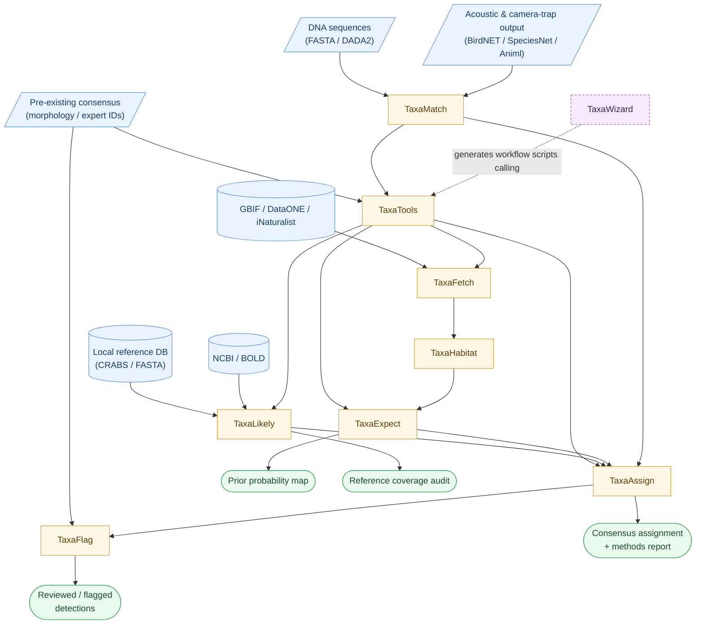
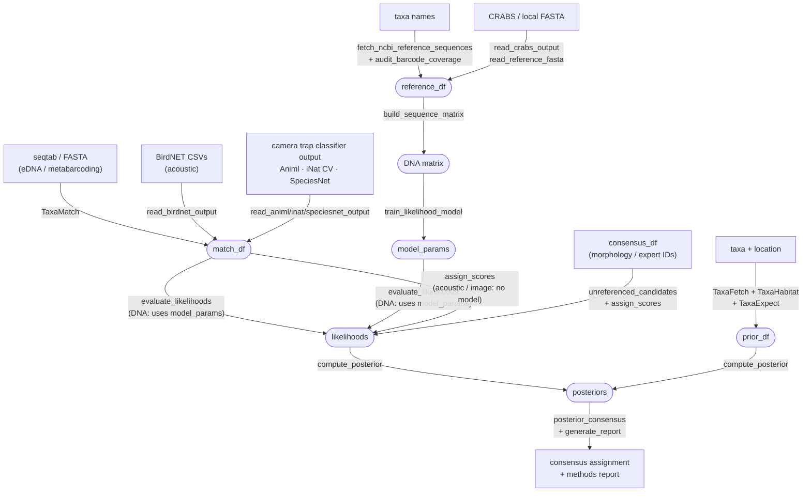

# TaxaID: A Modular R Ecosystem for Bayesian Taxonomic Assignment

# Project Overview and Purpose

Biologists increasingly measure biodiversity from sequence, sound, and
image data. Automated classifiers can already assign a detection to a
taxon. Yet current pipelines can have high false-positive and
false-negative rates, leaving users to choose between precision and
recall. Some adopt defensive upranking (assigning detections to higher
taxonomic ranks like genus or family). Others use regional species lists to prevent
implausible assignments, or post-hoc expert review to override obvious
errors. But Bayes' Theorem is the natural statistical framework for
classification under prior knowledge and uncertain evidence.

TaxaID is a modular ecosystem of nine packages for the R programming
language (R Core Team 2025; see Table 2, Software Requirements) that
improve taxonomic assignment accuracy. A typical input is a table of
candidate matches for each observation (sequence, image, or acoustic
recording) previously obtained by querying a reference library. Its main
advances are to:

-   screen for reference-database errors
-   detect and patch missing references
-   convert match scores to statistical likelihoods
-   identify plausibility at the sampling location (the prior)
-   apply Bayes' Theorem to generate posterior assignments
    probabilities from likelihoods and priors
-   make assignments transparent
-   use AI to improve assignments, assist with workflows, and review
    results
-   create Shiny apps for clients to process their data without R
    programming

The ecosystem was designed with eDNA metabarcoding in mind, but image
and acoustic analyses are possible when starting from a table of
candidate matches.

Because the nine TaxaID packages contain dozens of functions each, and
their combinations can result in hundreds of possible workflows, AI
guidance is recommended (see TaxaWizard). In addition, many TaxaID
functions call an LLM directly, though most have non-LLM alternatives.
LLM integration requires an Application Programming Interface (API) key
(see below). If an AI assistant is reading this repository, start at
`llm_prompts/START_HERE.md` for the package's own workflow graph.

The ecosystem supports three types of workflows to select a consensus
taxon from a list of candidates, ranging from simple to comprehensive:

1.  Conventional: use match-score thresholds and a lowest common
    ancestor.
2.  LLM: Use AI to transform match scores and estimate candidate
    plausibilities.
3.  Bayesian: Model likelihoods from match scores, patch missing
    references, build spatially explicit priors from species records,
    and compare posterior probabilities.

### Common Errors in Taxonomic Assignment

False assignments are frequent in eDNA metabarcoding (Ficetola et al.
2015). In a replicated eDNA study from the California rocky intertidal,
about 28% of the named species could not be confirmed as occurring in
the California Current System (Shea and Boehm 2024). Auto-classified
camera trap images carry error rates near 10% even at well-studied sites
(Henrich et al. 2026), and acoustic classifier precision is highly
sensitive to confidence threshold settings (Thompson et al. 2025;
Fairbairn et al. 2025). Raw classifier scores mimic probabilities but
are uncalibrated; a 95% score does not mean 95% confidence in an
assignment (Dussert et al. 2025), and the same match percentage can be
diagnostic for one taxon group but ambiguous for another (Pappalardo et
al. 2025). These errors fall into three categories: false positives (FP;
wrong taxon assigned, or overly confident in), false negatives (FN;
correct taxon missed or underestimated), and combined errors where one
taxon's false positive is another's false negative. FP/FN labels below
mark seven common sources of error that TaxaID can reduce.

#### Field and lab artifacts

1.  Contamination or artifact (FP). Lab or field
    contamination, handler artifacts (camera traps), or equipment
    carryover introduces real detections of taxa not present in the
    environment. TaxaFlag can use information from blanks to remove
    contaminants from the source. Downstream, TaxaFlag uses LLM review
    to alert the user to candidates that look like contaminants or
    allochthonous transport from outside the sampling area: eDNA carried
    by runoff or currents, sounds from playback devices or captive
    animals.

#### Reference database errors/gaps

2.  Reference mislabeling (FP). The occasional mislabeled
    sequence or image in a reference database can lead to false
    positives. TaxaMatch can check if accessions might be mislabeled so
    they can be removed before training models and generating consensus
    taxonomies. The check follows three steps:
    `corroborate_references_locally()` is a fast screen for whether a
    reference has internal consistency within the data (i.e., a
    reference is similar to other same-named references). Failing this
    check merits a more extensive evaluation of suspect references. For
    sequences, TaxaMatch uses `evaluate_reference_accessions()` using a
    BLAST search to see if an accession matches taxa related to its
    label, and `review_flagged_accessions()` gives flagged/borderline
    accessions a third look from an LLM; after which
    `resolve_review_overrides()` double checks if flagged accessions
    should be kept or removed. I find less than 1% of references to be
    mislabled, but worth removing.
3.  Missing reference redirect (FP + FN). The reference
    database itself is usually incomplete: when the true species has no
    entry in the reference library, its detections are incorrectly
    assigned to the closest referenced relative. Furthermore, reference
    library gaps are geographically biased, systematically affecting
    some regions and taxa more than others (Marques et al. 2021).
    TaxaLikely models the expected score profile of plausible
    unreferenced taxa so they can be considered as candidates.

#### Score misinterpretation

4.  Overconfident species assignment (FP + FN). Even when
    the correct species is present in the reference database, its raw
    match score is uncalibrated and should not be taken at face value; a
    100% match may still be ambiguous at species rank if competing
    candidates also score well. TaxaLikely models likelihoods from
    scores by using the reference database to discover how scores, and
    gaps between scores, help predict self vs non-self matches.
5.  Overly strict thresholds (FN). Conservative score
    cutoffs aimed to reduce false positives discard correct assignments
    that fall just below arbitrary thresholds. TaxaID's probabilistic
    framework replaces binary thresholds with continuous likelihoods and
    posteriors.

#### Ecological implausibility

6.  Ecologically implausible assignment (FP). A classifier
    usually does not know where the sample was taken, and thus has no
    shame assigning to a species that doesn't plausibly occur at the
    sampling location, season, or habitat. Spatially explicit priors
    from TaxaExpect down-weight implausible taxa.
7.  Defensive upranking (FN). When multiple similar
    species produce near-identical scores, conventional systems uprank
    to genus (or higher) to avoid a false positive, sacrificing
    species-level resolution. Spatial priors from TaxaExpect can break
    these ties. Dynamic Bayesian updating further sharpens priors within
    a sample after high-confidence detections support a species'
    presence.

### Package Descriptions

1.  TaxaTools enforces a consistent taxonomy by cleaning and
    standardizing taxonomic names across various backbones. It also
    provides a unified interface for calling LLMs from within the
    package.
2.  TaxaMatch standardizes match tables from external classifiers into a
    common format. It also checks for mislabled references.
3.  TaxaLikely converts match scores into calibrated likelihoods using a
    hierarchical Bayesian model trained on the reference library. It
    also audits references for coverage gaps.
4.  TaxaFetch acquires species occurrence records from data providers,
    and published literature (including reading data directly from
    PDFs).
5.  TaxaHabitat classifies taxa into habitat categories using LLM-based
    biological consensus, from which it assigns a habitat to each
    sampling event. It also helps the user flag errors in occurrence
    records.
6.  TaxaExpect builds spatially explicit Bayesian priors by modeling
    expected species composition (each taxon's relative share of the
    detections at a site) from fetched occurrence records, incorporating
    habitat and spatial autocorrelation. It can also create joint
    species distribution models for multiple (hundreds) of species.
7.  TaxaAssign computes posterior probabilities (and confidence) from
    likelihoods and priors, generates consensus taxonomy, and produces
    publication-ready reports that describe methods and results.
8.  TaxaFlag finds anomalous detections before and after assignment:
    contamination (lab/field blanks), handler artifacts (camera traps),
    and ecologically implausible assignments.
9.  TaxaWizard provides a self-referencing network of prompts for LLM
    support, or uses an in-house chat interface to interview the user
    about their data and goals, then generates a complete R script,
    methods section, or Shiny application.

See the README.md file for each package for more details.

### Dependency Chain (import order)

```         
TaxaTools -> TaxaFetch -> TaxaHabitat -> TaxaExpect -> TaxaAssign -> TaxaFlag
TaxaMatch -> TaxaLikely -> TaxaAssign -> TaxaFlag
TaxaWizard (standalone; generates scripts that call the other packages)
```

The diagram below shows how information flows among packages: external
data sources (parallelograms), external reference/occurrence databases
(cylinders), the nine packages (rectangles), and final outputs (rounded
terminals). `TaxaTools` is a cross-cutting utility (name cleaning,
backbone conversion, LLM calls) rather than a single pipeline step,
which is why it feeds several downstream packages directly rather than
sitting in one place in the chain.



`TaxaWizard` uses this flowchart to help users generate scripts
(`TaxaWizard/inst/graph/workflow_graph.json`); see the Pipeline Overview
section below for the finer-grained, object-level version.

# Citation

Lafferty, K.D., 2026, TaxaID: A modular R ecosystem for Bayesian
taxonomic assignment: U.S. Geological Survey software release,
<https://doi.org/10.5066/xxxxxx>.

Kevin D. Lafferty
[](https://orcid.org/0000-0001-7583-4593)

# Larger Citation

Associated Manuscript: Lafferty, K.D. In prep. TaxaID: A modular R
ecosystem for Bayesian taxonomic assignment from sequence, image, and
acoustic data.

# Licensing

Creative Commons 1.0 Universal (CC0 1.0;
<https://creativecommons.org/publicdomain/zero/1.0/>)

See [LICENSE.md](LICENSE.md) for details.

# Use of Large Language Models

TaxaID uses large language models in three distinct ways, and they
should not be confused.

In the software: several functions call an LLM as part of the analysis.
TaxaHabitat assigns habitat categories by biological consensus, TaxaFlag
reviews assignments for ecological plausibility, TaxaAssign offers an
LLM-elicited alternative to the modelled prior, and TaxaWizard generates
workflow scripts. All of these route through a common provider interface
(`TaxaTools::call_api()`), so any supported provider can be used, and
every one of them except TaxaWizard has a non-LLM alternative. Functions
that make billed API calls cache their results to disk, so re-running a
workflow does not pay for the same call twice.

In writing the code: the TaxaID source code was written with the
assistance of Anthropic Claude models, used through Claude Code. Claude
Sonnet did the bulk of the development; Claude Opus and Claude Fable
also contributed. Because this assistance was continuous rather than
confined to particular functions, per-function annotation would imply a
precision that does not exist, so this repository-level statement is the
annotation. All of it was reviewed and tested before release: every
package carries a `testthat` suite, and each was checked with
`R CMD check` before release. The author reviewed the code and takes
responsibility for it.

In assisting the user: TaxaWizard has three ways for users to interface
with LLMs to help write code and generate products.

# Related Software

Several R packages and standalone tools address taxonomic assignment
from DNA barcoding data. TaxaID differs in its explicit separation of
likelihood and prior, its spatially explicit priors built from
occurrence data, and its support for sequence, image and acoustic data.

Table 1. Comparison of TaxaID with related taxonomic assignment tools.

| Tool | Approach | Posterior probabilities | Spatial priors | Unreferenced taxa | Multi-data-type |
|---------------------------|----------------|--------------------|--------------|---------------------|--------------|
| TaxaID | Generative Bayesian (MVN score + gap) | Yes (full distribution) | Yes (GBIF + habitat) | Yes (NCBI census + LLM) | Yes |
| PROTAX (Somervuo et al. 2016) | Bayesian with taxonomy-tree prior | Yes | No | Yes (tree-based) | No (DNA only) |
| BayesANT (Zito et al. 2023) | Bayesian nonparametric (kmer) | Yes | No | Yes (Pitman-Yor) | No (DNA only) |
| IdTaxa / DECIPHER (Murali et al. 2018) | Phylogenetic ML | Bootstrap confidence | No | No | No (DNA only) |
| insect (Wilkinson et al. 2018) | Profile HMM + classification tree | Akaike weights | No | No | No (DNA only) |
| SINTAX (Edgar 2016) | Kmer + bootstrap | Bootstrap confidence | No | No | No (DNA only) |
| RDP Classifier (Wang et al. 2007) | Naive Bayes (8-mer) | Bootstrap confidence | No | No | No (DNA only) |
| DADA2 `assignTaxonomy` (Callahan et al. 2016) | Naive Bayes (kmer) | Bootstrap confidence | No | No | No (DNA only) |
| galaxy-tool-lca (Beentjes et al. 2019) | Score-threshold + LCA (deterministic) | No | No | No (upranked) | No (BLAST/DNA only) |

TaxaID is complementary to several of these tools. DADA2 or OBITools
handle upstream sequence processing and TaxaMatch ingests their output;
DECIPHER aligns reference sequences inside TaxaLikely. A large benchmark
(Orsholm et al. 2026) spanning PROTAX, BayesANT and similarity-,
composition- and placement-based classifiers found that no single
algorithm works across taxa and markers, which is why TaxaID treats
reference-database completeness as a modelled problem rather than
assuming one classification strategy generalizes.

galaxy-tool-lca (Beentjes et al. 2019;
<https://github.com/naturalis/galaxy-tool-lca>) filters BLAST hits by
identity, bitscore and query coverage, then takes the lowest common
ancestor, much like TaxaID's non-Bayesian `score_consensus()`. Its
mandatory coverage filter is a strength: a 98% identity match spanning
half the amplicon is weaker evidence than one spanning all of it.
TaxaID's likelihood model uses identity and the gap to the second-best
candidate but not coverage; filter on the BLAST `qcovs` column in
TaxaMatch first if coverage matters for your marker. The analogous
signal for acoustic references, the Xeno-canto quality grade, is not
filtered by default because the accuracy gain came with a real coverage
cost; apply a threshold to the recorded grade before training if you
want it.

Screening tools such as the Pest Alert Tool (Zaiko et al. 2023) and
BIOWATCH (Pearman et al. 2026) compare query sequences against a
curated list of species of interest and report which appear; BIOWATCH
builds custom BLAST databases with CRABS (Jeunen et al. 2023) and adds
control- and replicate-based checks. Several of its steps have TaxaID
counterparts: region-scoped species lists from a map polygon
(`TaxaTools::define_search_polygon()` with TaxaFetch), reference
retrieval and amplicon trimming (`TaxaLikely::fetch_ncbi_reference_sequences()`,
`trim_to_amplicon()`, and `read_crabs_output()` for CRABS output),
coverage auditing (`audit_barcode_coverage()`), control-based screening
(`TaxaFlag::flag_contaminant()`) and watch-list surveillance
(`flag_watch_candidates()`, `TaxaExpect::generate_invasive_watch_evidence()`).
The difference is in how confidence is expressed: these tools sort a
detection into ordinal tiers from raw scores, whereas TaxaID reports a
posterior probability, and a screening database restricted to target
species guarantees a best hit from that set even for a taxon with no
reference at all, the missing-reference redirect TaxaID models as its
own hypothesis (H3). TaxaID has no counterpart to BIOWATCH's multi-year
detection ledger; its scope ends at the assignment.

Table 1b. Comparison of TaxaID (image path) with standalone image
classifiers, which produce the raw scores TaxaMatch and TaxaLikely
process.

| Tool | Taxa scope | Score output | Spatial priors | Unreferenced taxa | R access |
|--------------------|-------------------|-----------------------|-------------------|---------------------|------------|
| TaxaID (image path) | Any (classifier-agnostic) | Calibrated likelihoods → Bayesian posteriors | Yes (GBIF + habitat) | Yes (coverage audit) | Native |
| animl / SpeciesNet (Tabak et al. 2019; Wildlife Insights\*) | Camera trap mammals | Confidence (0--1), top-5; rollup ensemble | No | No | `animl` R package |
| iNaturalist computer vision | General wildlife (108,000+ taxa) | Softmax (0--1), top-10; genus/family fallback | Limited (app UI only) | No | `rinat` (indirect) |
| InsectNet (Chiranjeevi et al. 2025) | Insects (2,526 spp, 17 orders) | Conformal prediction sets; OOD energy score | No | Limited (OOD flag) | Web app only |
| Seek / iNaturalist mobile | General wildlife | Community consensus | No | No | None |
| Wildlife Insights\* | Camera trap wildlife | Confidence (0--1), rollup ensemble | No | No | None (web platform) |

\* Wildlife Insights is a collaboration led by Conservation
International with Google, the Wildlife Conservation Society, WWF, the
Smithsonian Institution and others.

TaxaID sits downstream of these classifiers. Their confidence scores are
uncalibrated softmax outputs, so a 90% score does not mean a 90% chance
the identification is correct; TaxaLikely fits a generative model to a
labelled reference set to learn the score distributions for correct
matches, wrong-species matches and absent species. `animl` output is
read by `TaxaMatch::read_animl_output()`, iNaturalist computer-vision
JSON by `read_inaturalist_cv_output()`, and SpeciesNet batch predictions
by `read_speciesnet_output()`; TaxaMatch standardizes each to
`match_df`, then `unreferenced_candidates()` and `assign_scores()`
convert the scores to likelihoods with no reference-building step.
InsectNet (Chiranjeevi et al. 2025) returns conformal prediction sets
with an out-of-distribution score instead of a point score, a framing
close to TaxaID's H1/H2/H3, but its softmax scores are not exposed, so
its output cannot feed `train_likelihood_model()`.

For contamination, decontam (Davis et al. 2018) uses DNA concentration
and prevalence to identify contaminants before assignment.
TaxaFlag's `flag_contaminant()` is applied the same way when blanks
exist, and adds a post-hoc pass after assignment (handler proximity, LLM
review) for studies without them. Two gaps in the conventional toolkit
are addressed in TaxaFlag: `validate_controls()` tests whether the
samples labelled as controls behave like controls, since a mislabelled
blank makes the real community look like contamination; and
`flag_contaminant(require_control_evidence = TRUE)` treats
contamination as directional, separating control-to-sample
contamination from sample-to-control carryover, which a symmetric
prevalence score cannot do. The TaxaFlag README describes both.

# Data and Hardware Requirements {#data-and-hardware-requirements}

-   Internet access is required for GBIF queries, NCBI BLAST, and LLM
    API calls. Offline operation is possible when using cached data and
    local Ollama models.
-   NCBI rate limits: a large remote-BLAST run (e.g.
    `TaxaMatch::evaluate_reference_accessions()` over hundreds of
    reference accessions) can hit NCBI's own fair-use rate limiting or
    CPU-budget throttling partway through. TaxaMatch has functions to
    make remote BLAST calls more resilient: `blast_sequences()`'s
    circuit breaker (`max_consecutive_batch_failures`) detects sustained
    failures and stops early rather than waiting out every remaining
    doomed batch; `evaluate_reference_accessions()` caches its results
    incrementally (`chunk_size`) so an interrupted or throttled run only
    loses whatever chunk was in flight, and reports a recommended pause
    before resuming the same call.
    `TaxaMatch::review_flagged_accessions()`'s LLM second-look review is
    real, billed API cost too, and caches on the same principle
    (`cache_dir`); re-running it only pays for accessions whose inputs
    genuinely changed since the last review, not the whole set again.
-   No specialized hardware is required. All packages run on standard
    desktop hardware (macOS, Linux, or Windows) with R \>= 4.1.0.
-   Input data varies by entry point:
    -   eDNA workflow: DADA2 sequence table or FASTA file, plus sample
        metadata.
    -   Image/acoustic workflow: match score table with taxonomic
        identifications.
    -   Name-only workflow: a list of taxonomic names and site
        coordinates.

# Software Requirements

Table 2. Software dependencies required for the TaxaID ecosystem.

| Software | Version | OS bit | Reference |
|------------------|---------------------|----------------|----------------------------------------------------------|
| R | \>= 4.1.0 | 64 | R Core Team. 2025. R: A Language and Environment for Statistical Computing. V.4.5.2. <https://www.r-project.org>. |
| Bioconductor (DECIPHER, Biostrings) | \>= 3.17 | 64 | Gentleman et al. 2004. Bioconductor. <https://www.bioconductor.org>. DECIPHER is required for `TaxaLikely::build_sequence_matrix()`; Biostrings is also required for `TaxaLikely::trim_to_amplicon()`. |
| rBLAST | \>= 0.99 | 64 | Hahsler and Nagar. 2024. rBLAST. Bioconductor. <https://doi.org/10.18129/B9.bioc.rBLAST>. Optional; required only for local BLAST in TaxaMatch. |

All other R package dependencies are declared in each package's
DESCRIPTION file and will be installed automatically by
`devtools::install()` or `install.packages()`.

### API Keys {#api-keys}

To access LLM tools, the user can use a locally installed LLM (Ollama)
or an API key provided by an LLM service (set in `~/.Renviron`). A user
could use a different LLM by modifying one of the existing LLM calls.

| Key | Required By | How to Obtain |
|----------------------------------|-----------------------------|--------------------------------------------------|
| `ANTHROPIC_API_KEY` | TaxaTools (LLM calls) | <https://console.anthropic.com/> |
| `GEMINI_API_KEY` | TaxaTools (LLM calls) | <https://aistudio.google.com/apikey> (free tier) |
| `OPENAI_API_KEY` | TaxaTools (LLM calls) | <https://platform.openai.com/> (paid) |
| `AZURE_OPENAI_API_KEY` | TaxaTools (LLM calls; DOI employees only, requires DOI network or VPN) | Obtained through DOI IT channels |
| `OPENALEX_API_KEY` | TaxaFetch (literature search) | <https://openalex.org/settings/api> (free) |

No API key is needed for GBIF or NCBI queries. At least one LLM provider
key is needed for the LLM-shortcut workflow, TaxaHabitat habitat
assignment, and TaxaWizard.

# Software Installation

``` r
# Install from GitHub
install.packages("remotes")

packages <- c("TaxaTools", "TaxaFetch", "TaxaHabitat", "TaxaMatch",
               "TaxaLikely", "TaxaExpect", "TaxaAssign", "TaxaFlag",
               "TaxaWizard")

for (pkg in packages) {
  remotes::install_github("kdlafferty/TaxaID", subdir = pkg)
}

# Bioconductor dependency (needed for TaxaLikely reference matrix building)
if (!requireNamespace("BiocManager", quietly = TRUE))
  install.packages("BiocManager")
BiocManager::install("DECIPHER")
```

Do not reinstall a TaxaID package while an R session that has it loaded
is still running a workflow. R loads package code lazily by byte offset,
so a session that started on the old build reads the new build at the
old offsets: no error is raised and the results after the swap cannot be
trusted. Let the run finish, or quit that session, before installing.

After installation, load the packages:

``` r
library(TaxaTools)    # Name cleaning, LLM providers (auto-detects API keys)
library(TaxaFetch)    # Occurrence data acquisition
library(TaxaHabitat)  # Habitat assignment
library(TaxaMatch)    # Match standardization
library(TaxaLikely)   # Score-to-likelihood conversion
library(TaxaExpect)   # Spatially explicit priors
library(TaxaAssign)   # Posterior computation and consensus
library(TaxaFlag)     # Post-assignment quality flagging
library(TaxaWizard)   # Interactive workflow designer
```

Not all packages are needed for every workflow. At minimum, load
TaxaTools (always required) plus the packages for your workflow.

# Instructions for Using Software

## Packages

| Package | Purpose | License |
|------------------------|---------------------------------------------------------------|------------------------|
| [TaxaTools](TaxaTools/) | Name verification, cleaning, parsing, rank lookup, column standardization; LLM provider functions; GBIF backbone census | CC0 |
| [TaxaFetch](TaxaFetch/) | Occurrence data acquisition (GBIF, DataONE, PDF, literature search), source combination | CC0 |
| [TaxaHabitat](TaxaHabitat/) | Habitat assignment via LLM biological consensus; spatial QAQC | CC0 |
| [TaxaMatch](TaxaMatch/) | Match standardization. Sequence input (DADA2/FASTA), BLAST search. | CC0 |
| [TaxaLikely](TaxaLikely/) | Convert match scores to likelihoods using hierarchical Bayesian model; reference QC | CC0 |
| [TaxaExpect](TaxaExpect/) | Spatially explicit Bayesian priors from occurrence and habitat data | CC0 |
| [TaxaAssign](TaxaAssign/) | Posterior computation, consensus taxonomy, report generation | CC0 |
| [TaxaFlag](TaxaFlag/) | Post-assignment anomalous detection flagging (contamination, transport, scope) | CC0 |
| [TaxaWizard](TaxaWizard/) | Conversational LLM workflow designer: guided interview to .R script, .md methods, or Shiny app | CC0 |

## Pipeline Overview

The diagram below shows the full set of supported workflow paths. Every
path converges at the assignment step; users can start from whichever
inputs they have.



TaxaWizard can generate a complete R script for any of the paths above
via a guided interview: `workflow_create()`.

## Which Entry Point Do I Need?

If you're not sure where to start, don't just start typing into an AI
chat. Upload `llm_prompts/START_HERE.md` and `llm_prompts/CONTEXT_TaxaID.md`
into an LLM chat window instead: they carry the package's own workflow
graph, so the assistant identifies the workflow node and edge for your
goal before guessing at individual functions. If you have an API key
set up, `TaxaWizard::workflow_create()` runs the same interview from R,
in the console or a browser window, and writes a complete, runnable
script that `workflow_app()` can turn into a Shiny app. For example: "I
have BLAST results from an eDNA metabarcoding study. I want to assign
species only when the sequence matches at 100%, and otherwise retain a
higher-level assignment" is a match-scores-in, consensus-out request,
the `match_to_consensus_score` edge (score-based consensus, no Bayesian
priors or LLM), with the 100% rule translated to that edge's
`min_score`/rank-threshold parameters rather than a hand-written filter.
See [Using TaxaID with any
LLM](TaxaWizard/README.md#using-taxaid-with-any-llm) in the TaxaWizard
README.

If you'd rather find the right starting point yourself, match your data
to a row below:

| Your starting point | Start here |
|--------------------------------------------|-------------------------------------------------------------------|
| DADA2 sequence table or FASTA file (eDNA/metabarcoding) | `TaxaMatch::read_sequence_table()` / `TaxaMatch::blast_sequences()`, see `TaxaMatch/inst/workflow_fastq_to_match.R` |
| BirdNET CSV output (acoustic) | `TaxaMatch::read_birdnet_output()`, see `TaxaMatch/inst/workflow_image_acoustic.R` |
| Camera-trap classifier output (Animl / iNaturalist CV / SpeciesNet) | `TaxaMatch::read_animl_output()` / `read_inaturalist_cv_output()` / `read_speciesnet_output()` |
| A table of candidate matches you've already built (any data type) | Start at `TaxaLikely::evaluate_likelihoods()` (or `assign_scores()` for a no-training-data pathway) |
| Expert/morphological IDs with no match scores at all | `TaxaLikely::unreferenced_candidates()` + `assign_scores(score_type = "none")` |
| Just a list of taxon names and site coordinates (no observation data yet) | Fetch occurrences (e.g. `TaxaFetch::get_gbif_occurrences()`), then `TaxaExpect::estimate_kernel_priors()`, see `TaxaExpect/README.md`'s Quick Start. |

For a worked example of a single pipeline stage, see that package's own
`inst/workflows/*.R` scripts and its vignette, e.g.
`TaxaLikely/inst/workflows/sequence_likelihood_workflow.R`,
`TaxaMatch/inst/workflows/blast_sequences_workflow.R`,
`TaxaAssign/inst/workflows/compute_posteriors_workflow.R`.

To build a complete workflow for a new site, start from
`inst/TaxaID_Workflow_Template.R` (see "The workflow template" below),
or let TaxaWizard generate one for your data.

To confirm your installation works, run one of the fast "smoke" tests.
Each chains `evaluate_likelihoods()` -\> `compute_posterior()` -\>
`posterior_consensus()` -\> `add_slash_taxon()` against a small real
fixture extracted from a completed production run, in a few seconds,
with no network calls and no API key:

``` r
# from the repository root -- fixture paths are resolved via system.file()
# against the installed (or devtools::load_all()'d) TaxaWizard package
library(TaxaWizard)
source(system.file("fast_workflows", "run_fast_smoketest.R", package = "TaxaWizard"))            # ~7 s
source(system.file("fast_workflows", "run_greatlakes_fast_smoketest.R", package = "TaxaWizard")) # ~6 s
```

Both print warnings about hypotheses below `min_posterior` and about
genus-level names in `plausible_taxa`. Those are expected: the fixtures
use a flat placeholder prior, which is labelled in each script. See
`TaxaWizard/inst/fast_workflows/README.md`.

For a run with real data and keys, four tutorial scripts chain through
checkpoints in `tempdir()`: `TaxaFetch/inst/workflows/fetch_occurrences_workflow.R`
(two genera of gadids in a North Atlantic box, a few hundred records),
`TaxaHabitat/inst/workflows/assign_habitat_workflow.R` (one LLM call),
`TaxaExpect/inst/workflows/generate_priors_workflow.R` and
`TaxaAssign/inst/workflows/compute_posteriors_workflow.R`. Run them in
that order in one R session; each script says what it reads and writes.

### The workflow template

`inst/TaxaID_Workflow_Template.R` is a single-site template covering the
canonical path from raw sequences to reviewed assignments. Edit its
Section 0, supply your own input, and run it top to bottom. It carries
no study's data and no real paths.

It is generated, not written.
`TaxaWizard/inst/tools/build_workflow_template.R` assembles it from the
workflow graph's own snippets, the same files TaxaWizard generates
scripts from, resolving each step's inputs from the graph's edge wiring
and each parameter from one configuration table.

`TaxaWizard/tests/testthat/test-workflow-template.R` regenerates it and
fails if the committed file differs, and separately asserts that it
parses, that every `Pkg::fn` it calls is a real export, and that every
named argument is a real formal. A snippet change that never reached the
template breaks the build rather than quietly making the template wrong.

To update it after changing a snippet:

``` bash
Rscript TaxaWizard/inst/tools/build_workflow_template.R
```

## Getting Started

Each package includes a vignette with a worked example:

``` r
# Ecosystem overview (recommended starting point)
vignette("taxaid-ecosystem", package = "TaxaAssign")

# Individual package vignettes
vignette("name-cleaning", package = "TaxaTools")
vignette("data-acquisition", package = "TaxaFetch")
vignette("habitat-assignment", package = "TaxaHabitat")
vignette("match-standardization", package = "TaxaMatch")
vignette("score-to-likelihood", package = "TaxaLikely")
vignette("building-priors", package = "TaxaExpect")
vignette("taxonomic-assignment", package = "TaxaAssign")
vignette("quality-flagging", package = "TaxaFlag")
```

## Workflow Scripts

Detailed, runnable workflow scripts are provided in each package's
`inst/` or `inst/workflows/` directory:

| Workflow | Package | Script |
|----------------------------------------|------------------------|---------------------------------------------------|
| FASTQ to match data (eDNA) | TaxaMatch | `inst/workflow_fastq_to_match.R` |
| Image and acoustic identification | TaxaMatch | `inst/workflow_image_acoustic.R` |
| Fetch reference sequences (DNA) | TaxaLikely | `inst/workflows/1_fetch_references_workflow.R` |
| Flag reference errors | TaxaLikely | `inst/workflows/2_flag_errors_workflow.R` |
| Train likelihood model (DNA) | TaxaLikely | `inst/workflows/3_train_model_workflow.R` |
| Score to likelihood (image/acoustic) | TaxaLikely | `inst/workflows/image_acoustic_likelihood_workflow.R` |
| Score to likelihood (DNA) | TaxaLikely | `inst/workflows/4_score_to_likelihood_workflow.R` |
| Audit reference coverage | TaxaLikely | `inst/workflows/5_audit_coverage_workflow.R` |
| No-score pathway (morphology/expert IDs) | TaxaLikely | `inst/workflows/6_no_score_pathway_workflow.R` |
| Fetch occurrences | TaxaFetch | `inst/Merge_sources_workflow.R` |
| Assign habitats | TaxaHabitat | `inst/workflows/assign_habitat_workflow.R` |
| Build priors | TaxaExpect | `inst/workflows/generate_priors_workflow.R` |
| LLM assignment | TaxaAssign | `inst/TaxaAssign_llm_workflow.R` |
| Bayesian assignment | TaxaAssign | `inst/TaxaAssign_bayesian_workflow.R` |

For a step-by-step map of the full pipeline (inputs, outputs, and save
conventions across all packages) see
[ECOSYSTEM_WORKFLOW.md](ecosystem_docs/ECOSYSTEM_WORKFLOW.md).

## High-Level Wrappers

For users who prefer a single-function interface:

``` r
library(TaxaAssign)

# Full Bayesian pipeline (~1 call, plus a saved model generated by TaxaLikely)
result <- run_bayesian_pipeline(match_df, model_params, taxaexpect_priors = taxaexpect_priors,
                                 backbone_id = 11)  # 11 = GBIF backbone; 4 = NCBI

# LLM-shortcut pipeline (~1 call)
result <- run_llm_pipeline(match_df, geographic_hint = "34.4 N, -119.8 W", habitat_scheme = "Marine",
                            backbone_id = 11)  # 11 = GBIF backbone; 4 = NCBI
```

# Caching and resources {#caching-and-resources}

Complex workflows are only tractable because slow or metered steps, like
GBIF downloads, NCBI/BOLD fetches, BLAST calls, and LLM calls, are
cached to disk and skipped on a repeat run. Caches differ in whether
they are on by default, and in whether they're worth keeping between
projects:

| Package | Cached by default? | What's cached | Worth keeping? |
|------------------|---------------------------------------------|------------------|--------------------------------|
| TaxaFetch | Yes (`download_gbif_occurrences()`, `fetch_gbif_occurrences()`, `check_geographic_outliers()`) | GBIF occurrence downloads | No (large and re-downloadable; this is the biggest cache in practice, multiple GB is normal) |
| TaxaLikely | Yes (`fetch_ncbi_reference_sequences()`, `audit_barcode_coverage()`) | NCBI reference-sequence metadata + FASTA | Somewhat (re-fetchable, but a large taxon list can take hours) |
| TaxaMatch | Yes (`evaluate_reference_accessions()`, `investigate_flagged_accession()`, `review_flagged_accessions()`) | Reference-accession mislabel-screen verdicts (BLAST + LLM review) | Yes (expensive to rebuild, and it's row-level with its own TTLs, not a flat file store) |
| TaxaHabitat | No, off unless you pass `cache_dir` (`build_habitat_lookup()`) | Per-taxon LLM habitat assignments | Yes (an unstable verdict shifts which occurrence records count toward a site, so keeping it is what makes a re-run reproducible) |
| TaxaFlag | No, off unless you pass `cache_dir` (`review_assignments()`, `check_gbif_tile_range()`) | LLM review verdicts / GBIF density-tile verdicts | Yes, for the same reproducibility reason as TaxaHabitat |
| TaxaTools | Mixed | `refresh_models()`'s LLM model registry caches to a fixed, non-configurable path; `scientific_to_common()` and `fetch_worms_attributes()` default to no persistent cache (`cache_dir = NULL`) unless you supply one | Model registry: yes, tiny. Common-name/WoRMS lookups: worth turning on if you re-run over the same taxon list |
| TaxaWizard | Yes, fixed path, not configurable | The introspected function/workflow registry (`workflow_registry()`) | Yes, but it's tiny and rebuilds itself when a package version changes |

All of the "Yes" and "Mixed" defaults above use
`tools::R_user_dir("<Package>", "cache")`; a per-user directory outside
your project, invisible unless you go looking for it. Where a function
defaults to `cache_dir = NULL`, nothing is written to disk until you
pass a directory; the production workflows pass one explicitly for
exactly the functions listed above as "No."

The five `<pkg>_clear_cache()` functions (`taxafetch_clear_cache()`,
`taxalikely_clear_cache()`, `taxahabitat_clear_cache()`,
`taxaflag_clear_cache()`, `taxatools_clear_cache()`) share one
signature: `cache_dir`, `older_than_days`, `dry_run`, `force` (TaxaFetch
adds `orphans_only`/`zips_only`; TaxaTools' `cache_dir` has no default,
so pass the same directory you gave the caching function). TaxaMatch has
none: its cache is a few files holding many TTL'd rows each, not one
file per key, so deleting by file would discard live verdicts. All five
run on one shared engine,
`TaxaTools::list_cache_files()`/`report_and_clear_cache()`, which
refuses to clear a directory holding anything other than that package's
own cache files unless `force = TRUE`.
`TaxaTools::taxaid_cache_report(extra_dirs = NULL, warn_gb = 1)` reports
every cache on the machine (size, file count, and age per package,
flagging anything at or above `warn_gb` gigabytes) without deleting
anything; pass `extra_dirs` for any project-local cache directory a
workflow used instead of the default.

`fetch_ncbi_reference_sequences(evict_unreachable_cache = TRUE)` (the
default) is narrower and safer than a full clear: on every write it
deletes that taxon's own cache files that no current cache key could
ever produce again (generations superseded by an earlier key widening),
leaves anything over 5 MB in place for you to remove by hand, and
reports what it removed. It runs automatically on every fetch rather
than as a function you call yourself; `taxalikely_clear_cache()` is the
blunt, whole-directory alternative when you want a full clear instead.
`TaxaTools::cache_ok(path, inputs)` checks a single cached file against
the files it was derived from and reports it stale if any input is
newer. Use it in your own scripts around a checkpoint `.rds`, not around
a remote query (that has no local file to compare against).

Memory. `TaxaFetch::filter_gbif_quality()` costs roughly 4 GB of RAM per
million input rows and does not chunk internally. It takes the whole
data frame at once, so pre-split a very large fetch by taxon or region
before filtering it. `download_gbif_occurrences()` already narrows
columns by default (`select_cols`) and warns after a run if the cache
directory exceeds `cache_prompt_mb` (default 5 GB).
`TaxaLikely::build_sequence_matrix()` aligns the whole reference set in
one pass by default; for a set spanning many genera, `by_genus = TRUE`
replaces that with many small per-genus alignments, which scales far
better. `TaxaMatch::evaluate_reference_accessions()` already submits
BLAST in `chunk_size = 200`-accession batches and caches incrementally,
so an interrupted run only loses the in-progress chunk.
`TaxaExpect::estimate_kernel_priors()` holds the entire
`occurrence_data` frame you pass it in memory for the call and does not
chunk. Keep that input to what one site's kernel actually needs rather
than the full pooled occurrence set.

Disk. Point any `cache_dir` argument at a larger drive when your default
(home) volume is small. Every cache above accepts one. A content-keyed
cache (anything under `tools::R_user_dir()`, or any `cache_dir` you pass
to a fetch/evaluate/review function) is meant to be reused across runs
and projects; a workflow's own per-run output directory is not a cache
and should not be treated as one.

# Troubleshooting

"No LLM provider configured" or an LLM call silently returns a
uniform/degraded result. Confirm the relevant key (see [API
Keys](#api-keys), above) is set in `~/.Renviron`, not just your current
shell session, then restart R. Provider auto-detection runs when a
TaxaID package is attached with `library()`: calling functions only via
`TaxaTools::call_api()` (fully namespaced, no `library()` call) skips
it. If you're running a script non-interactively (`Rscript`, not
RStudio) and still see this after setting the key, pass a provider
explicitly:

``` r
llm_fn <- function(prompt) TaxaTools::call_api(prompt, provider = "anthropic")
```

A recent bug fix or package update doesn't seem to have taken effect.
The most common cause is an R session that had the old version loaded
before the update was installed. After any `remotes::install_github()`
(or `devtools::install()` from source):

``` r
.rs.restartR()                          # restart, clearing anything already loaded
library(TaxaTools)                       # reload every package you use
packageDescription("TaxaTools")$Built    # confirm this build is recent, not stale
```

If a workflow caches intermediate results to `.rds` checkpoint files
(most of the worked-example scripts under each package's `inst/` do this
so long steps aren't re-run unnecessarily), a fix to logic downstream of
an existing checkpoint won't show up until that checkpoint is deleted or
the workflow is re-run with caching disabled. A raw-data fetch cache
generally does not need clearing when only downstream
filtering/statistical logic changed, but check the specific script's own
caching comments if a fix doesn't seem to be taking effect.

GBIF or NCBI calls are slow, throttled, or fail partway through a large
fetch. See the NCBI rate-limit note under [Data and Hardware
Requirements](#data-and-hardware-requirements): functions that make many
requests (`evaluate_reference_accessions()`,
`download_gbif_occurrences()`, `fetch_ncbi_reference_sequences()`)
support `cache_dir`, so an interrupted run can resume from where it left
off instead of restarting from scratch. `blast_sequences()` itself has
no cache; call it through `evaluate_reference_accessions()` when you
need one (see [Caching and resources](#caching-and-resources)).

Getting help. If none of the above resolves it, please open an issue at
<https://github.com/kdlafferty/TaxaID/issues> with your R version, the
exact error message, and a minimal reproducible example if possible.
This helps other users hitting the same issue find the answer too, and
keeps a public record other than a private email thread.

# Data Outputs and Results

Each stage writes a data frame the next stage reads; the package READMEs
describe each in full.

| Output | Package and function |
|---|---|
| Occurrence records standardized to Darwin Core columns, with habitat assignments and spatial quality flags | TaxaFetch `stack_occurrences()`; TaxaHabitat `assign_habitat_biological()`, `flag_habitat_inconsistencies()` |
| Reference-library assessment: mislabel verdicts, coverage audits, model diagnostics | TaxaMatch `corroborate_references_locally()`, `evaluate_reference_accessions()`; TaxaLikely `audit_barcode_coverage()`, `interpret_model()` |
| Priors: a Beta prior per taxon at the focal site, including undetected diversity, and the prior field as a map or data frame | TaxaExpect `estimate_kernel_priors()`, `generate_undetected_diversity()`, `plot_theta_surface()`, `theta_surface_at()` |
| Assignment: calibrated likelihoods, posterior probabilities with uncertainty, and a consensus taxon per detection with every competing candidate retained | TaxaLikely `evaluate_likelihoods()`; TaxaAssign `compute_posterior()`, `posterior_consensus()`, `score_consensus()` |
| Quality flags and a Methods and Results report | TaxaFlag `flag_contaminant()`, `flag_handler()`, `review_assignments()`; TaxaAssign `generate_report()`; TaxaTools `assemble_report()` |

# Software Inventory

| Package     | Exported Functions | Test Files | Vignette |
|-------------|--------------------|------------|----------|
| TaxaTools   | 58                 | 29         | Yes      |
| TaxaFetch   | 30                 | 26         | Yes      |
| TaxaHabitat | 18                 | 12         | Yes      |
| TaxaMatch   | 31                 | 22         | Yes      |
| TaxaLikely  | 31                 | 31         | Yes      |
| TaxaExpect  | 17                 | 17         | Yes      |
| TaxaAssign  | 15                 | 17         | Yes      |
| TaxaFlag    | 11                 | 13         | Yes      |
| TaxaWizard  | 9                  | 10         | No       |

# U.S. Geological Survey Disclaimer

This software is preliminary or provisional and is subject to revision.
It is being provided to meet the need for timely best science. The
software has not received final approval by the U.S. Geological Survey
(USGS). No warranty, expressed or implied, is made by the USGS or the
U.S. Government as to the functionality of the software and related
material nor shall the fact of release constitute any such warranty. The
software is provided on the condition that neither the USGS nor the U.S.
Government shall be held liable for any damages resulting from the
authorized or unauthorized use of the software.

Non-endorsement of commercial products and services: Any use of trade,
firm, or product names is for descriptive purposes only and does not
imply endorsement by the U.S. Government.

# References

Altschul, S.F., Gish, W., Miller, W., Myers, E.W. and Lipman, D.J.
(1990). Basic local alignment search tool. *Journal of Molecular
Biology*, 215(3), 403--410.

Beentjes, K.K., Speksnijder, A.G.C.L., Schilthuizen, M., Hoogeveen, M.,
Pastoor, R. and van der Hoorn, B.B. (2019). Increased performance of DNA
metabarcoding of macroinvertebrates by taxonomic sorting. *PLOS ONE*,
14(12), e0226527.

Callahan, B.J., McMurdie, P.J., Rosen, M.J., Han, A.W., Johnson, A.J.A.
and Holmes, S.P. (2016). DADA2: High-resolution sample inference from
Illumina amplicon data. *Nature Methods*, 13(7), 581--583.

Chiranjeevi, S., Saadati, M., Deng, Z.K., Koushik, J., Jubery, T.Z.,
Mueller, D.S., O'Neal, M., Merchant, N., Singh, Aarti, Singh, A.K.,
Sarkar, S., Singh, Arti and Ganapathysubramanian, B. (2025). InsectNet:
Real-time identification of insects using an end-to-end machine learning
pipeline. *PNAS Nexus*, 4(1), pgae575.
<https://doi.org/10.1093/pnasnexus/pgae575>

Davis, N.M., Proctor, D.M., Holmes, S.P., Relman, D.A. and Callahan,
B.J. (2018). Simple statistical identification and removal of
contaminant sequences in marker-gene and metagenomics data.
*Microbiome*, 6, 226.

Dussert, G., Chamaillé-Jammes, S., Dray, S. and Miele, V. (2025). Being
confident in confidence scores: calibration in deep learning models for
camera trap image sequences. *Remote Sensing in Ecology and
Conservation*, 11(1), 88--99.

Edgar, R.C. (2016). SINTAX: a simple non-Bayesian taxonomy classifier
for 16S and ITS sequences. *bioRxiv*, 074161.

Fairbairn, A.J., Burmeister, J.S., Weisser, W.W. and Meyer, S.T. (2025).
BirdNET can be as good as experts for acoustic bird monitoring in a
European city. *PLoS One*, 20(9), e0330836.

Ficetola, G.F., Pansu, J., Bonin, A., Coissac, E., Giguet-Covex, C., De
Barba, M., Gielly, L., Lopes, C.M., Boyer, F., Pompanon, F., Rayé, G.
and Taberlet, P. (2015). Replication levels, false presences and the
estimation of the presence/absence from eDNA metabarcoding data.
*Molecular Ecology Resources*, 15(3), 543--556.

Gentleman, R.C., Carey, V.J., Bates, D.M., Bolstad, B., Dettling, M.,
Dudoit, S., Ellis, B., Gautier, L., Ge, Y., Gentry, J., Hornik, K.,
Hothorn, T., Huber, W., Iacus, S., Irizarry, R., Leisch, F., Li, C.,
Maechler, M., Rossini, A.J., Sawitzki, G., Smith, C., Smyth, G.,
Tierney, L., Yang, J.Y.H. and Zhang, J. (2004). Bioconductor: open
software development for computational biology and bioinformatics.
*Genome Biology*, 5, R80.

Hahsler, M. and Nagar, A. (2024). rBLAST: R Interface for the Basic
Local Alignment Search Tool. R package version 0.99.4. Bioconductor.
<https://doi.org/10.18129/B9.bioc.rBLAST>

Henrich, M., Fiderer, C., Klamm, A., Schneider, A., Ballmann, A., Stein,
J., Kratzer, R., Reiner, R., Greiner, S., Twietmeyer, S., Rönitz, T.,
Spicher, V., Chamaillé-Jammes, S., Miele, V., Dussert, G. and Heurich,
M. (2026). Camera traps and deep learning enable efficient large-scale
density estimation of wildlife in temperate forest ecosystems. *Remote
Sensing in Ecology and Conservation*, 12(1), 148--163.

Jeunen, G.-J., Dowle, E., Edgecombe, J., von Ammon, U., Gemmell, N.J.
and Cross, H. (2023). crabs: A software program to generate curated
reference databases for metabarcoding sequencing data. *Molecular
Ecology Resources*, 23(3), 725--738.

Lafferty, K.D., 2026, TaxaID: A modular R ecosystem for Bayesian
taxonomic assignment: U.S. Geological Survey software release,
<https://doi.org/10.5066/xxxxxx>.

Macher, T.-H., Beermann, A.J. and Leese, F. (2021). TaxonTableTools: a
comprehensive, platform-independent graphical user interface software to
explore and visualise DNA metabarcoding data. *Molecular Ecology
Resources*, 21(5), 1705--1714.

Marques, V., Milhau, T., Albouy, C., Dejean, T., Manel, S., Mouillot, D.
and Juhel, J.-B. (2021). GAPeDNA: assessing and mapping global species
gaps in genetic databases for eDNA metabarcoding. *Diversity and
Distributions*, 27(10), 1880--1892.

Murali, A., Bhargava, A. and Wright, E.S. (2018). IDTAXA: a novel
approach for accurate taxonomic classification of microbiome sequences.
*Microbiome*, 6, 140.

Orsholm, J., Zito, A., Somervuo, P., Harrison, J.P., Koskela, M.,
Ovaskainen, O., Braga, M.P., Chazot, N., Roslin, T. and Furneaux, B.
(2026). Discovering the unseen: A performance comparison of taxonomic
classification methods for unknown DNA barcodes. *Methods in Ecology and
Evolution*, 17(9), 2574--2593.

Pappalardo, P., Hemmi, J.M., Machida, R.J., Leray, M., Collins, A.G. and
Osborn, K.J. (2025). Taxon-specific BLAST percent identity thresholds
for identification of unknown sequences using metabarcoding. *Methods in
Ecology and Evolution*, 16(10), 2380--2394.

Pearman, J.K., Aylagas, E. and Carvalho, S. (2026). BIOWATCH: a R shiny
application for the detection of species of interest in metabarcoding
datasets. *BMC Bioinformatics*, 27, 147.
<https://doi.org/10.1186/s12859-026-06468-2>

R Core Team (2025). *R: A Language and Environment for Statistical
Computing*. Version 4.5.2. R Foundation for Statistical Computing,
Vienna, Austria. <https://www.r-project.org>

Shea, M.M. and Boehm, A.B. (2024). Environmental DNA metabarcoding
differentiates between micro-habitats within the rocky intertidal.
*Environmental DNA*, 6(2), e521.

Somervuo, P., Koskela, S., Pennanen, J., Nilsson, R.H. and Ovaskainen,
O. (2016). Unbiased probabilistic taxonomic classification for DNA
barcoding. *Bioinformatics*, 32(19), 2920--2927.

Somervuo, P., Yu, D.W., Xu, C.C.Y., Ji, Y., Hultman, J., Wirta, H. and
Ovaskainen, O. (2017). Quantifying uncertainty of taxonomic placement in
DNA barcoding and metabarcoding. *Methods in Ecology and Evolution*,
8(4), 398--407.

Tabak, M.A., Norouzzadeh, M.S., Wolfson, D.W., Sweeney, S.J.,
Vercauteren, K.C., Snow, N.P., Halseth, J.M., Di Salvo, P.A., Lewis,
J.S., White, M.D., Teton, B., Beasley, J.C., Schlichting, P.E.,
Boughton, R.K., Wight, B., Newkirk, E.S., Ivan, J.S., Odell, E.A.,
Brook, R.K., Lukacs, P.M., Moeller, A.K., Mandeville, E.G., Clune, J.
and Miller, R.S. (2019). Machine learning to classify animal species in
camera trap images: applications in ecology. *Methods in Ecology and
Evolution*, 10(4), 585--590.

Thompson, M.C., Ducey, M.J., Gunn, J.S. and Rowe, R.J. (2025). A
post-processing framework for assessing BirdNET identification accuracy
and community composition. *Ibis*, 167(2), 530--542.

Wang, Q., Garrity, G.M., Tiedje, J.M. and Cole, J.R. (2007). Naive
Bayesian classifier for rapid assignment of rRNA sequences into the new
bacterial taxonomy. *Applied and Environmental Microbiology*, 73(16),
5261--5267.

Wilkinson, S.P., Davy, S.K., Bunce, M. and Stat, M. (2018). Taxonomic
identification of environmental DNA with informatic sequence
classification trees. *PeerJ Preprints*, 6, e26812v1.
<https://doi.org/10.7287/peerj.preprints.26812v1>

Zaiko, A., Greenfield, P., Abbott, C., von Ammon, U., Bilewitch, J.,
Bunce, M., Cristescu, M.E., Chariton, A., Dowle, E., Geller, J., Ardura
Gutierrez, A., Hajibabaei, M., Haggard, E., Inglis, G.J., Lavery, S.D.,
Samuiloviene, A., Simpson, T., Stat, M., Stephenson, S., Sutherland, J.,
Thakur, V., Westfall, K., Wood, S.A., Wright, M., Zhang, G. and Pochon,
X. (2023). Pest Alert Tool: a web-based application for flagging species
of concern in metabarcoding datasets. *Nucleic Acids Research*, 51(W1),
W438--W442.

Zito, A., Rigon, T. and Dunson, D.B. (2023). Inferring taxonomic
placement from DNA barcoding aiding in discovery of new taxa. *Methods
in Ecology and Evolution*, 14(2), 529--542.
