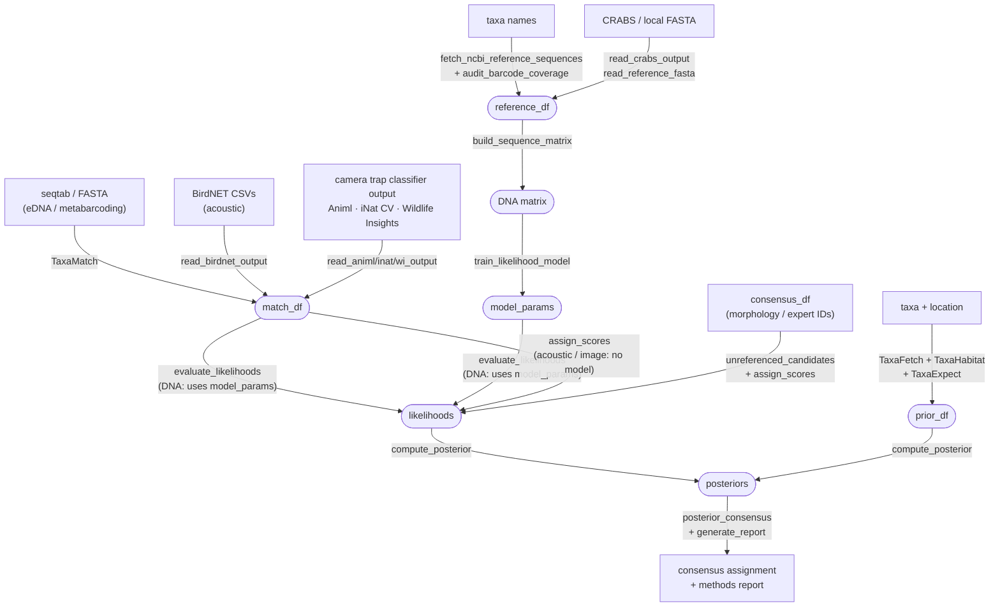

# TaxaID: A Modular R Ecosystem for Bayesian Taxonomic Assignment

# Project Overview and Purpose

Biologists increasingly measure biodiversity from sequence, sound, and
image data, yet current pipelines can have high false-positive and
false-negative rates for taxonomic assignment. TaxaID is a modular
ecosystem of nine packages for the R programming language (R Core Team
2025; see Table 2, Software Requirements) that improve taxonomic
assignment accuracy. A typical input is a table of candidate matches for
each observation (sequence, image, or acoustic recording) previously
obtained by querying a reference library. TaxaID can implement
traditional score-threshold approaches (e.g., a fixed percent-identity
cutoff paired with lowest-common-ancestor assignment, as in
galaxy-tool-lca; Beentjes et al. 2019 -- see Related Software, below),
but its main advances are to:

1.  screen for reference-database errors
2.  detect and patch taxa missing from the reference library
3.  consider whether a taxon is plausible at the sampling location
4.  apply Bayes' Theorem to generate assignment probabilities from match
    scores
5.  Make assignments transparent
6.  Use LLMs to improve assignments, assist with workflows, and review
    results

To apply Bayes' Theorem, TaxaID converts match scores to likelihoods,
estimates spatially explicit occurrence-based priors (from GBIF and/or
user data), and computes posterior probabilities of taxonomic identity.
The ecosystem was designed with eDNA metabarcoding in mind, but image
and acoustic analyses are possible when starting from a table of
candidate matches.

The ecosystem supports three workflows, ranging from simple to
comprehensive:

-   **Traditional workflow** -- Select a consensus taxon using score
    thresholds and/or a lowest common ancestor (covers many current
    approaches).
-   **LLM-shortcut workflow** -- Use large language models (LLMs) --
    Anthropic Claude (Anthropic PBC, San Francisco, California), Google
    Gemini (Google LLC, Mountain View, California), OpenAI (OpenAI OpCo,
    LLC, San Francisco, California), or local Ollama (Ollama, Palo Alto,
    California) -- to rapidly estimate priors and generate consensus
    assignments.
-   **Bayesian workflow** -- Train a likelihood model on reference data,
    build spatially explicit priors from GBIF (Global Biodiversity
    Information Facility; GBIF Secretariat, Copenhagen, Denmark)
    occurrences, and compute posteriors via Monte Carlo simulation.

These workflows converge at the same posterior consensus step, enabling
direct comparison of model-based and LLM-based assignments.

Many TaxaID functions can use large language models (LLMs), though most
have non-LLM alternatives. LLM integration requires an Application
Programming Interface (API) key (see below).

### Common Errors in Taxonomic Assignment

Automated classifiers for DNA, sound, and image data produce taxonomic
assignments with systematic errors that are often difficult to detect.
In a replicated eDNA study from the California rocky intertidal, 28% of
metazoan sequences matched taxa not present on the Pacific Coast (Shea
and Boehm 2024). Camera trap false positive rates can exceed 40% for
rare species (Thompson et al. 2025), and acoustic classifier precision
is highly sensitive to confidence threshold settings (Fairbairn et al.
2025). Raw classifier scores mimic probabilities but are uncalibrated;
95% score does not mean 95% confidence (Dussert et al. 2025), and the
same match percentage can be diagnostic for one taxon group but
ambiguous for another (Ficetola et al. 2015). These errors fall into
three categories: false positives (FP; wrong taxon assigned, or overly
confident in), false negatives (FN; correct taxon missed or
underestimated), and combined errors where one taxon's false positive is
another's false negative. FP/FN labels below mark which category each
error mechanism produces.

#### Reference database quality

**Reference mislabeling** (FP). Mislabeled sequences or images already
present in the reference database can lead to confident wrong
assignments that propagate to every query matching that reference.
*TaxaMatch BLASTs each reference accession and flags accessions whose
top hits disagree with their own listed taxonomy, allowing a user to
block or remove them as candidates (`evaluate_reference_accessions()`,
`flag_incongruent_references()`, `remove_incongruent_references()`). A
flag alone can't distinguish a genuine mislabel from a marker with poor
resolving power for that lineage; `review_flagged_accessions()`
optionally sends the flagged subset to an LLM for a free-text second
look (known hybrid crosses, informal specimen codes) without ever
re-deciding the flag itself.*

**Missing reference redirect** (FP + FN). The reference database itself
usually incomplete: when the true species has no entry in the reference
library at all, its detections are assigned to the closest relative that
does have an entry, a false positive for that relative and a false
negative for the true species. Reference library gaps are geographically
biased, systematically affecting some regions and taxa more than others
(Marques et al. 2021). *TaxaLikely models the expected score profile of
unreferenced taxa, and TaxaAssign identifies and names plausible missing
species.*

#### Score interpretation

**Overconfident species assignment** (FP + FN). Even when the correct
species IS present in the reference database, its raw match score is
uncalibrated and taken at face value; a 100% match may still be
ambiguous at species rank if competing candidates score nearly as well.
Unlike the reference-gap problems above, this error arises purely from
how scores are interpreted, not from what the reference database
contains. *TaxaLikely's calibrated likelihoods account for the fact that
a high score with a small gap to alternatives has low species-level
likelihood, regardless of the raw score.*

**Overly strict thresholds** (FN). Conservative score cutoffs discard
correct assignments that fall just below arbitrary thresholds. *TaxaID's
probabilistic framework replaces binary thresholds with continuous
likelihoods and posteriors.*

#### Ecological context

**Defensive upranking** (FN). When multiple similar species produce
near-identical scores, conventional systems uprank to genus to avoid a
false positive, sacrificing species-level resolution. *Spatial priors
from TaxaExpect can break ties; if only one candidate species is
expected at the site, its posterior can support species-level assignment
even when scores alone cannot. Dynamic Bayesian updating further
sharpens priors within a sample after high-confidence detections support
species presence.*

**Ecologically implausible assignment** (FP). A species is assigned that
doesn't plausibly occur at the sampling location, season, or habitat.
*Spatially explicit priors from TaxaExpect down-weight implausible taxa.
Dynamic updating within a sample reinforces ecologically consistent
assignments.*

#### Field and lab artifacts

**Contamination or artifact** (FP). Lab or field contamination, handler
artifacts (camera traps), or equipment carryover introduces real
detections of taxa not present in the environment. *TaxaFlag detects
proportion-based and temporal-proximity artifacts.*

**Allochthonous transport** (FP). Detections originate from outside the
sampling area: eDNA carried by runoff or currents, sounds from playback
devices or captive animals. *Spatial priors inherently down-weight
species outside their expected habitat.*

*Additionally, TaxaFlag provides LLM-based expert review that can flag
most of these error types post-assignment.*

### Ecosystem Packages

1.  **TaxaTools** cleans and standardizes taxonomic names across
    backbones (GBIF; NCBI, the National Center for Biotechnology
    Information, U.S. National Library of Medicine, National Institutes
    of Health, Bethesda, Maryland; WoRMS, the World Register of Marine
    Species, Flanders Marine Institute (VLIZ), Ostend, Belgium;
    Catalogue of Life, hosted by Naturalis Biodiversity Center, Leiden,
    Netherlands) and provides a unified interface for calling LLMs from
    within the package.
2.  **TaxaFetch** acquires species occurrence records from GBIF, DataONE
    (Data Observation Network for Earth; University of New Mexico,
    Albuquerque, New Mexico), BioTIME (University of St Andrews, St
    Andrews, Scotland, United Kingdom), and published literature.
3.  **TaxaHabitat** classifies taxa into habitat categories using
    LLM-based biological consensus and flags spatial outliers.
4.  **TaxaMatch** standardizes match tables from external tools (BLAST,
    the Basic Local Alignment Search Tool -- Altschul et al. 1990,
    hosted by NCBI; camera-trap classifiers; acoustic detectors) into a
    common format, and screens reference accessions for mislabels via
    independent BLAST-based taxonomic congruence checking before the
    reference set is used for model training.
5.  **TaxaLikely** converts match scores into calibrated likelihoods
    using a hierarchical Bayesian model trained on the reference
    library, trimming poor-fitting matches during training and auditing
    references for coverage gaps.
6.  **TaxaExpect** builds spatially explicit Bayesian priors by modeling
    species occurrence probability from observation records,
    incorporating habitat and spatial autocorrelation.
7.  **TaxaAssign** computes posterior probabilities from likelihoods and
    priors, generates consensus taxonomy, and produces publication-ready
    reports.
8.  **TaxaFlag** flags anomalous detections after assignment:
    contamination (lab/field blanks), handler artifacts (camera traps),
    and ecologically implausible assignments.
9.  **TaxaWizard** interviews the user about their data and goals, then
    generates a complete R script, methods section, or Shiny
    application.

### Dependency Chain

```         
TaxaTools -> TaxaFetch -> TaxaHabitat -> TaxaExpect -> TaxaAssign -> TaxaFlag
TaxaMatch -> TaxaLikely -> TaxaAssign -> TaxaFlag
TaxaWizard (standalone; generates scripts that call the other packages)
```

The diagram below shows the same chain at the level of real data
handoffs between packages, rather than just import order: external data
sources (parallelograms), external reference/occurrence databases
(cylinders), the nine packages (rectangles), and final outputs (rounded
terminals). `TaxaTools` is a cross-cutting utility (name cleaning,
backbone conversion, LLM calls) rather than a single pipeline step,
which is why it feeds several downstream packages directly rather than
sitting in one place in the chain.


This diagram is a package-level collapse of the same underlying graph
`TaxaWizard` walks to generate scripts
(`TaxaWizard/inst/graph/workflow_graph.json`), so it can't drift far
from what the functions actually do; see the *Pipeline Overview* section
below for the finer-grained, object-level version of the same flow.

# Citation

Lafferty, K.D., 2026, TaxaID -- A modular R ecosystem for Bayesian
taxonomic assignment: U.S. Geological Survey software release,
<https://doi.org/10.5066/xxxxxx>.

Kevin D. Lafferty
[](https://orcid.org/0000-0001-7583-4593)

# Larger Citation

*Associated Manuscript:* Lafferty, K.D. In prep. TaxaID: A modular R
ecosystem for Bayesian taxonomic assignment from sequence, image, and
acoustic data.

# Licensing

Creative Commons 1.0 Universal (CC0 1.0;
<https://creativecommons.org/publicdomain/zero/1.0/>)

See [LICENSE.md](LICENSE.md) for details. TaxaExpect depends on glmmTMB
(GPL \>= 3); the TaxaExpect source code itself is CC0, but binary
distributions that bundle glmmTMB may be subject to GPL terms.

# Related Software

Several R packages and standalone tools address taxonomic assignment
from DNA barcoding data. TaxaID differs from these in its explicit
separation of likelihood and prior, spatially explicit priors built from
occurrence data, and multi-data-type support (DNA, image, acoustic).

**Table 1.** Comparison of TaxaID with related taxonomic assignment
tools.

| Tool | Approach | Posterior probabilities | Spatial priors | Unreferenced taxa | Multi-data-type |
|------------|------------|------------|------------|------------|------------|
| **TaxaID** | Generative Bayesian (MVN score + gap) | Yes (full distribution) | Yes (GBIF + habitat) | Yes (NCBI census + LLM) | Yes |
| PROTAX (Somervuo et al. 2017) | Bayesian with taxonomy-tree prior | Yes | No | Yes (tree-based) | No (DNA only) |
| BayesANT (Zito et al. 2023) | Bayesian nonparametric (kmer) | Yes | No | Yes (Pitman-Yor) | No (DNA only) |
| IdTaxa / DECIPHER (Murali et al. 2018) | Phylogenetic ML | Bootstrap confidence | No | No | No (DNA only) |
| insect (Wilkinson et al. 2018) | Profile HMM + classification tree | Akaike weights | No | No | No (DNA only) |
| SINTAX (Edgar 2016) | Kmer + bootstrap | Bootstrap confidence | No | No | No (DNA only) |
| RDP Classifier (Wang et al. 2007) | Naive Bayes (8-mer) | Bootstrap confidence | No | No | No (DNA only) |
| DADA2 `assignTaxonomy` (Callahan et al. 2016) | Naive Bayes (kmer) | Bootstrap confidence | No | No | No (DNA only) |
| galaxy-tool-lca (Beentjes et al. 2019) | Score-threshold + LCA (deterministic) | No | No | No (upranked) | No (BLAST/DNA only) |

TaxaID is complementary to several of these tools rather than a
replacement. DADA2 or OBITools handle upstream sequence processing;
TaxaMatch ingests their output. DECIPHER is used internally by
TaxaLikely for reference sequence alignment. The key innovation of
TaxaID is that the same likelihood model can be combined with different
spatial priors at different sites, and that the framework extends to
image and acoustic data via TaxaMatch score standardization.

A large recent benchmark (Orsholm et al. 2026), spanning several tools
listed in Table 1 (PROTAX, BayesANT) alongside similarity-,
composition-, and phylogenetic-placement-based classifiers, confirms
that no single algorithm dominates the reference-gap problem:
phylogenetic placement (EPA-ng) performed best for arthropod COI
barcodes, while composition-based classifiers (SINTAX, RDP-NBC, IDTAXA)
performed best for fungal ITS, reflecting real differences in how
alignable each marker is. This supports TaxaID's own approach of
treating reference-database completeness as a first-class, explicitly
modeled problem rather than assuming one classification strategy
generalizes across markers.

The galaxy-tool-lca code (Beentjes et al. 2019;
<https://github.com/naturalis/galaxy-tool-lca>) is a widely used tool,
written in Python (Python Software Foundation, Wilmington, Delaware),
for LCA-based taxonomic assignment from BLAST results, particularly for
freshwater macroinvertebrate eDNA and fungal Internal Transcribed Spacer
(ITS) metabarcoding. Its core algorithm, which filters BLAST hits by
identity, bitscore, and query coverage, then finds the lowest common
ancestor among passing hits, is conceptually similar to TaxaID's
`score_consensus()`. A notable strength of galaxy-tool-lca is its
explicit use of **query coverage** (the fraction of the query sequence
that aligns to each reference hit) as a mandatory quality filter,
alongside percent identity and bitscore. A 98% identity match that
covers only half the amplicon is weaker evidence than one spanning the
full amplicon, and coverage is already available as a BLAST output
column (`qcovs`). TaxaID's likelihood model currently uses score
(percent identity) and the gap to the second-best candidate as its
primary signals but does not incorporate alignment coverage. Users can
partially address this upstream by filtering on coverage in TaxaMatch
before passing match data to TaxaLikely; incorporating coverage as a
third dimension in the likelihood model is a potential future
enhancement. The analogous quality signal for acoustic reference data is
the Xeno-canto (Xeno-canto Foundation, Netherlands, with support from
Naturalis Biodiversity Center, Leiden; <https://xeno-canto.org/>)
quality grade (A–E per recording); a dedicated helper for calibrating a
quality-grade filtering threshold from it existed in TaxaLikely through
2026-09-09 and was archived after a real A/B test found the accuracy
gain came with a real coverage cost (see TaxaLikely's own README and
CLAUDE.md) -- a threshold can still be applied directly against the
recorded quality-grade column before model training.

**Table 1b.** Comparison of TaxaID (image path) with standalone image
classifiers. TaxaID converts raw classifier confidence scores into
calibrated likelihoods via a reference training set with known species
identity, then multiplies those likelihoods by spatially explicit
priors; the tools below produce the raw scores that TaxaMatch and
TaxaLikely process.

| Tool | Taxa scope | Score output | Spatial priors | Unreferenced taxa | R access |
|------------|------------|------------|------------|------------|------------|
| **TaxaID (image path)** | Any (classifier-agnostic) | Calibrated likelihoods → Bayesian posteriors | Yes (GBIF + habitat) | Yes (coverage audit) | Native |
| animl / SpeciesNet (Tabak et al. 2019; Wildlife Insights\*) | Camera trap mammals | Confidence (0--1), top-5; rollup ensemble | No | No | `animl` R package |
| iNaturalist computer vision | General wildlife (108,000+ taxa) | Softmax (0--1), top-10; genus/family fallback | Limited (app UI only) | No | `rinat` (indirect) |
| InsectNet (He et al. 2025) | Insects (2,526 spp, 17 orders) | Conformal prediction sets; OOD energy score | No | Limited (OOD flag) | Web app only |
| Seek / iNaturalist mobile | General wildlife | Community consensus | No | No | None |
| Wildlife Insights\* | Camera trap wildlife | Confidence (0--1), rollup ensemble | No | No | None (web platform) |

\* Wildlife Insights is a collaboration led by Conservation
International (Arlington, Virginia) with Google LLC (Mountain View,
California), the Wildlife Conservation Society (Bronx Zoo, Bronx, New
York), WWF, the Smithsonian Institution, and others.

TaxaID is downstream of, not competing with, these classifiers. The key
point is that raw confidence scores from neural networks are
uncalibrated softmax outputs; a 90% confidence score does not mean a 90%
chance the identification is correct. TaxaLikely addresses this by
fitting a generative model to a labeled reference set with known species
identity, capturing the full score distribution for correct matches
(H1), wrong-species matches (H2), and absent-species responses (H3).
`animl` (Conservation Technology Lab, San Diego Zoo Wildlife Alliance,
San Diego, California) results are read directly by
`TaxaMatch::read_animl_output()`; iNaturalist (a joint initiative of the
California Academy of Sciences and the National Geographic Society, San
Francisco, California) CV JSON output is read by
`TaxaMatch::read_inaturalist_cv_output()`; SpeciesNet CLI
(`google/cameratrapai`; Google LLC, Mountain View, California) batch
predictions are read by `TaxaMatch::read_speciesnet_output()`. For
acoustic and image data, TaxaLikely acts as a post-classifier
calibration layer: classifier output is standardized to `match_df` by
TaxaMatch, then `unreferenced_candidates()` + `assign_scores()` convert
classifier confidence scores to likelihoods (no separate
reference-building step required).

InsectNet (He et al. 2025) is a notable recent advance for invertebrate
specialists, achieving 96.4% top-1 accuracy across 2,526 species in 17
insect orders. Its standout methodological innovation is replacing point
confidence scores with **conformal prediction sets**: rather than a
single species estimate, the model returns a set of candidate species
guaranteed to contain the true species with ≥97.5% probability, backed
by an energy-based out-of-distribution score that flags images outside
the training distribution. The conformal guarantee is conceptually
related to TaxaID's H1/H2/H3 framework; the true species is either in
the candidate set (H1/H2) or flagged as OOD (H3 analog). The outputs are
not directly compatible with `train_likelihood_model()`, however, given
the lack of access to InsectNet's underlying softmax scores.

For contamination detection, the R package decontam (Davis et al. 2018)
uses DNA concentration and prevalence to identify contaminants at the
ASV level before taxonomic assignment. TaxaFlag's proportion-based
control comparison (`flag_contaminant()`) is typically applied the same
way, before assignment, to remove likely contaminants when field or lab
blanks are defined. However, TaxaFlag also runs a second, post-hoc pass
after assignment: temporal proximity analysis, LLM expert review, and a
combined view that rejoins the earlier contaminant flags against the
final assignments.

# Data and Hardware Requirements {#data-and-hardware-requirements}

-   **Internet access** is required for GBIF queries, NCBI BLAST, and
    LLM API calls. Offline operation is possible when using cached data
    and local Ollama models.
-   **NCBI rate limits**: a large remote-BLAST run (e.g.
    `TaxaMatch::evaluate_reference_accessions()` over hundreds of
    reference accessions) can hit NCBI's own fair-use rate limiting or
    CPU-budget throttling partway through. TaxaMatch has some functions
    designed to make remote BLAST more robust. Importantly, it knows
    when to stop trying; `blast_sequences()`'s circuit breaker
    (`max_consecutive_batch_failures`) detects sustained failures and
    stops early rather than waiting out every remaining doomed batch;
    `evaluate_reference_accessions()` caches its results incrementally
    (`chunk_size`) so an interrupted or throttled run only loses
    whatever chunk was in flight, and reports a recommended pause before
    resuming the same call. `TaxaMatch::review_flagged_accessions()`'s
    LLM second-look review is real, billed API cost too, and caches on
    the same principle (`cache_dir`); re-running it only pays for
    accessions whose inputs genuinely changed since the last review, not
    the whole set again.
-   **No specialized hardware** is required. All packages run on
    standard desktop hardware (macOS, Linux, or Windows) with R \>=
    4.1.0.
-   **Input data** varies by entry point:
    -   *eDNA workflow*: DADA2 sequence table or FASTA file, plus sample
        metadata.
    -   *Image/acoustic workflow*: match score table with taxonomic
        identifications.
    -   *Name-only workflow*: a list of taxonomic names and site
        coordinates.

# Software Requirements

**Table 2.** Software dependencies required for the TaxaID ecosystem.

| Software | Version | OS bit | Reference |
|------------------|------------------|------------------|------------------|
| R | \>= 4.1.0 | 64 | R Core Team. 2025. R: A Language and Environment for Statistical Computing. V.4.5.2. <https://www.r-project.org>. |
| Bioconductor (DECIPHER, Biostrings) | \>= 3.17 | 64 | Gentleman et al. 2004. Bioconductor. <https://www.bioconductor.org>. Required only for `TaxaLikely::build_sequence_matrix()`. |
| rBLAST | \>= 0.99 | 64 | Hahsler and Nagar. 2019. rBLAST. <https://github.com/mhahsler/rBLAST>. Optional; required only for local BLAST in TaxaMatch. |

All other R package dependencies are declared in each package's
DESCRIPTION file and will be installed automatically by
`devtools::install()` or `install.packages()`.

### API Keys {#api-keys}

To access LLM tools, the user can use a locally installed LLM (Ollama)
or an API key provided by an LLM service (set in `~/.Renviron`). A user
could use a different LLM by modifying one of the existing LLM calls.

| Key | Required By | How to Obtain |
|------------------------|------------------------|------------------------|
| `ANTHROPIC_API_KEY` | TaxaTools (LLM calls) | <https://console.anthropic.com/> |
| `GEMINI_API_KEY` | TaxaTools (LLM calls) | <https://aistudio.google.com/apikey> (free tier) |
| `OPENAI_API_KEY` | TaxaTools (LLM calls) | <https://platform.openai.com/> (paid) |
| `OPENALEX_API_KEY` | TaxaFetch (literature search) | <https://openalex.org/settings/api> (free) |

No API key is needed for GBIF or NCBI queries. At least one LLM provider
key is needed for the LLM-shortcut workflow, TaxaHabitat habitat
assignment, and TaxaWizard.

# Software Installation

``` r
# Install from GitHub
install.packages("remotes")

packages <- c("TaxaTools", "TaxaFetch", "TaxaHabitat", "TaxaMatch",
               "TaxaLikely", "TaxaExpect", "TaxaAssign", "TaxaFlag",
               "TaxaWizard")

for (pkg in packages) {
  remotes::install_github("kdlafferty/TaxaID", subdir = pkg)
}

# Bioconductor dependency (needed for TaxaLikely reference matrix building)
if (!requireNamespace("BiocManager", quietly = TRUE))
  install.packages("BiocManager")
BiocManager::install("DECIPHER")
```

After installation, load the packages:

``` r
library(TaxaTools)    # Name cleaning, LLM providers (auto-detects API keys)
library(TaxaFetch)    # Occurrence data acquisition
library(TaxaHabitat)  # Habitat assignment
library(TaxaMatch)    # Match standardization
library(TaxaLikely)   # Score-to-likelihood conversion
library(TaxaExpect)   # Spatially explicit priors
library(TaxaAssign)   # Posterior computation and consensus
library(TaxaFlag)     # Post-assignment quality flagging
library(TaxaWizard)   # Interactive workflow designer
```

Not all packages are needed for every workflow. At minimum, load
TaxaTools (always required) plus the packages for your workflow.

# Instructions for Using Software

## Packages

| Package | Purpose | License |
|------------------------|------------------------|------------------------|
| [TaxaTools](TaxaTools/) | Name verification, cleaning, parsing, rank lookup, column standardization; LLM provider functions; GBIF backbone census | CC0 |
| [TaxaFetch](TaxaFetch/) | Occurrence data acquisition (GBIF, DataONE, PDF, literature search), source combination | CC0 |
| [TaxaHabitat](TaxaHabitat/) | Habitat assignment via LLM biological consensus; spatial QAQC | CC0 |
| [TaxaMatch](TaxaMatch/) | Match standardization. Sequence input (DADA2/FASTA), BLAST search. | CC0 |
| [TaxaLikely](TaxaLikely/) | Convert match scores to likelihoods using hierarchical Bayesian model; reference QC | CC0 |
| [TaxaExpect](TaxaExpect/) | Spatially explicit Bayesian priors from occurrence and habitat data | CC0 |
| [TaxaAssign](TaxaAssign/) | Posterior computation, consensus taxonomy, report generation | CC0 |
| [TaxaFlag](TaxaFlag/) | Post-assignment anomalous detection flagging (contamination, transport, scope) | CC0 |
| [TaxaWizard](TaxaWizard/) | Conversational LLM workflow designer: guided interview to .R script, .md methods, or Shiny app | CC0 |

## Pipeline Overview

The diagram below shows the full set of supported workflow paths. Every
path converges at the assignment step; users can start from whichever
inputs they have.



*TaxaWizard can generate a complete R script for any of the paths above
via a guided interview: `workflow_create()`.*

## Which Entry Point Do I Need?

If you're not sure where to start, the fastest path is often the least
code: `TaxaWizard::workflow_create()` interviews you about your data and
goals and generates a complete, runnable R script for you (see
[Interactive Workflow Designer](#interactive-workflow-designer), below).
If you'd rather find the right starting point yourself, match your data
to a row below:

| Your starting point | Start here |
|------------------------------------|------------------------------------|
| DADA2 sequence table or FASTA file (eDNA/metabarcoding) | `TaxaMatch::read_sequence_table()` / `TaxaMatch::blast_sequences()` -- see `inst/workflow_fastq_to_match.R` |
| BirdNET CSV output (acoustic) | `TaxaMatch::read_birdnet_output()` -- see `inst/workflow_image_acoustic.R` |
| Camera-trap classifier output (Animl / iNaturalist CV / SpeciesNet) | `TaxaMatch::read_animl_output()` / `read_inaturalist_cv_output()` / `read_speciesnet_output()` |
| A table of candidate matches you've already built (any data type) | Start at `TaxaLikely::evaluate_likelihoods()` (or `assign_scores()` for a no-training-data pathway) |
| Expert/morphological IDs with no match scores at all | `TaxaLikely::unreferenced_candidates()` + `assign_scores(score_type = "none")` |
| Just a list of taxon names and site coordinates (no observation data yet) | Fetch occurrences (e.g. `TaxaFetch::get_gbif_occurrences()`), then `TaxaExpect::estimate_kernel_priors()` -- see `TaxaExpect/README.md`'s Quick Start. |

A genuinely runnable, self-contained worked example that exercises the
full pipeline end to end -- no external data files, though it does need
`DECIPHER`/`rentrez` installed and at least one LLM API key set, since
it makes real BLAST/GBIF/NCBI/LLM calls -- lives at
[`inst/TaxaID_Workflow_Template_TEST.R`](inst/TaxaID_Workflow_Template_TEST.R).
It bundles its own tiny 3-ASV fixture, so `source()`-ing it (or stepping
through it interactively) requires no data preparation at all -- a good
way to confirm your installation and API keys work before pointing the
same pipeline at your own data.

## Getting Started

Each package includes a vignette with a worked example:

``` r
# Ecosystem overview (recommended starting point)
vignette("taxaid-ecosystem", package = "TaxaAssign")

# Individual package vignettes
vignette("name-cleaning", package = "TaxaTools")
vignette("data-acquisition", package = "TaxaFetch")
vignette("habitat-assignment", package = "TaxaHabitat")
vignette("match-standardization", package = "TaxaMatch")
vignette("score-to-likelihood", package = "TaxaLikely")
vignette("building-priors", package = "TaxaExpect")
vignette("taxonomic-assignment", package = "TaxaAssign")
vignette("quality-flagging", package = "TaxaFlag")
```

## Workflow Scripts

Detailed, runnable workflow scripts are provided in each package's
`inst/` or `inst/workflows/` directory:

| Workflow | Package | Script |
|------------------------|------------------------|------------------------|
| FASTQ to match data (eDNA) | TaxaMatch | `inst/workflow_fastq_to_match.R` |
| Image and acoustic identification | TaxaMatch | `inst/workflow_image_acoustic.R` |
| Fetch reference sequences (DNA) | TaxaLikely | `inst/workflows/1_fetch_references_workflow.R` |
| Flag reference errors | TaxaLikely | `inst/workflows/2_flag_errors_workflow.R` |
| Train likelihood model (DNA) | TaxaLikely | `inst/workflows/3_train_model_workflow.R` |
| Score to likelihood (image/acoustic) | TaxaLikely | `inst/workflows/image_acoustic_likelihood_workflow.R` |
| Score to likelihood (DNA) | TaxaLikely | `inst/workflows/4_score_to_likelihood_workflow.R` |
| Audit reference coverage | TaxaLikely | `inst/workflows/5_audit_coverage_workflow.R` |
| No-score pathway (morphology/expert IDs) | TaxaLikely | `inst/workflows/6_no_score_pathway_workflow.R` |
| **Demo: local reference library** | TaxaLikely | `inst/workflows/local_reference_demo.R` |
| Fetch occurrences | TaxaFetch | `inst/Merge_sources_workflow.R` |
| Assign habitats | TaxaHabitat | `inst/workflows/assign_habitat_workflow.R` |
| Build priors | TaxaExpect | `inst/TaxaExpect_workflow.R` |
| LLM assignment | TaxaAssign | `inst/TaxaAssign_llm_workflow.R` |
| Bayesian assignment | TaxaAssign | `inst/TaxaAssign_bayesian_workflow.R` |

For a step-by-step map of the full pipeline — inputs, outputs, and save
conventions across all packages — see
[ECOSYSTEM_WORKFLOW.md](ecosystem_docs/ECOSYSTEM_WORKFLOW.md).

## High-Level Wrappers

For users who prefer a single-function interface:

``` r
library(TaxaAssign)

# Full Bayesian pipeline (~1 call, plus a saved model generated by TaxaLikely)
result <- run_bayesian_pipeline(match_df, model, site = list(lat = 34.4, lon = -119.8, main_habitat = "Marine"))

# LLM-shortcut pipeline (~1 call)
result <- run_llm_pipeline(match_df, site = list(lat = 34.4, lon = -119.8, main_habitat = "Marine"))
```

## Interactive Workflow Designer {#interactive-workflow-designer}

TaxaWizard provides a guided, conversational interface:

``` r
library(TaxaWizard)

# Opens a chat interface that interviews you about your data and goals,
# then generates a complete, runnable R script convertible to a shiny app.
workflow_create()
```

# Troubleshooting

**"No LLM provider configured" or an LLM call silently returns a
uniform/degraded result.** Confirm the relevant key (see [API
Keys](#api-keys), above) is set in `~/.Renviron`, not just your current
shell session, then restart R. Provider auto-detection runs when a
TaxaID package is attached with `library()` -- calling functions only
via `TaxaTools::call_api()` (fully namespaced, no `library()` call)
skips it. If you're running a script non-interactively (`Rscript`, not
RStudio) and still see this after setting the key, pass a provider
explicitly:

``` r
llm_fn <- function(prompt) TaxaTools::call_api(prompt, provider = "anthropic")
```

**A recent bug fix or package update doesn't seem to have taken
effect.** The most common cause is an R session that had the old version
loaded before the update was installed. After any
`remotes::install_github()` (or `devtools::install()` from source):

``` r
.rs.restartR()                          # restart, clearing anything already loaded
library(TaxaTools)                       # reload every package you use
packageDescription("TaxaTools")$Built    # confirm this build is recent, not stale
```

If a workflow caches intermediate results to `.rds` checkpoint files
(most of the worked-example scripts under each package's `inst/` do this
so long steps aren't re-run unnecessarily), a fix to logic *downstream*
of an existing checkpoint won't show up until that checkpoint is deleted
or the workflow is re-run with caching disabled -- a raw-data fetch
cache generally does not need clearing when only downstream
filtering/statistical logic changed, but check the specific script's own
caching comments if a fix genuinely doesn't seem to be taking effect.

**GBIF or NCBI calls are slow, throttled, or fail partway through a
large fetch.** See the NCBI rate-limit note under [Data and Hardware
Requirements](#data-and-hardware-requirements) -- functions that make
many requests (`evaluate_reference_accessions()`, `blast_sequences()`,
`download_gbif_occurrences()`) support `cache_dir`, so an interrupted
run can resume from where it left off instead of restarting from
scratch.

**Getting help.** If none of the above resolves it, please open an issue
at <https://github.com/kdlafferty/TaxaID/issues> with your R version,
the exact error message, and a minimal reproducible example if possible
-- this helps other users hitting the same issue find the answer too,
and keeps a public record other than a private email thread.

# Data Outputs and Results

The TaxaID ecosystem produces outputs at each stage of the pipeline:

### Occurrence Data and Habitat

-   **Compiled occurrence records** from GBIF, DataONE, BioTIME, and
    literature extraction, standardized to Darwin Core columns
    (`stack_occurrences()`).
-   **Habitat assignments** per taxon via weighted biological consensus
    across multiple habitat classification schemes
    (`assign_habitat_biological()`).
-   **Spatial quality flags** identifying occurrences whose coordinates
    conflict with species habitat expectations
    (`flag_habitat_inconsistencies()`). These may be used to flag errant
    GBIF records.

### Reference Library Assessment

-   **Mislabel detection** identifying swapped or incorrectly labeled
    sequences in reference databases, via a free local-corroboration
    check followed by a BLAST-based screen
    (`TaxaMatch::corroborate_references_locally()`,
    `TaxaMatch::evaluate_reference_accessions()`). This can help users
    avoid basing assignments on reference errors.
-   **Coverage audits** enumerating described species per genus and
    flagging taxa absent from the reference library
    (`audit_barcode_coverage()`, `audit_reference_coverage()`). This can
    help users understand limits in precision.
-   **Model diagnostics** summarizing expected match percentages, score
    gaps, and per-species profiles (`interpret_model()`). This can help
    users understand how scores relate to precision.

### Species Distribution Models and Priors

-   **Site-centered kernel estimation** (current recommended path)
    predicting species occurrence probability at a focal site from a
    distance-weighted (geo x optional-covariate) kernel over nearby
    occurrence records, with bandwidth chosen by leave-one-block-out
    composition prediction (`estimate_kernel_priors()`,
    `calibrate_kernel_bandwidth()`).
-   **Beta priors** (alpha, beta) for every taxon at the focal site,
    including undetected diversity estimates (Good-Turing/Chao-anchored)
    for plausible but unobserved species
    (`generate_undetected_diversity()`).
-   **KDE prior-field maps** -- static or interactive Leaflet views of
    the estimator evaluated continuously across a lattice, not just at
    one site (`plot_theta_surface()`).

### Taxonomic Assignment

-   **Calibrated likelihoods** from a hierarchical Bayesian model
    trained on reference-vs-reference match scores, supporting three
    hypothesis types: known species (H1), unreferenced species (H2), and
    unreferenced genus (H3) (`evaluate_likelihoods()`).
-   **Posterior probabilities** of taxonomic identity for each
    observation, with Monte Carlo uncertainty estimates
    (`compute_posterior()`).
-   **Consensus taxonomy** assignments at the finest rank supported by
    the data, with confidence scores and consensus method labels
    (`posterior_consensus()`, `score_consensus()`).

### Quality Control and Reporting

-   **Quality flags** for anomalous detections: contamination scores
    from lab/field blanks, temporal handler proximity, LLM expert review
    (`flag_contaminant()`, `flag_handler()`, `review_assignments()`).
-   **Publication-ready text** (Methods and Results sections) via
    template-based and LLM-assisted report generation, with per-package
    report sections that assemble into a unified document
    (`generate_report()`, `assemble_report()`).

# Software Inventory

| Package     | Exported Functions | Test Files | Vignette |
|-------------|--------------------|------------|----------|
| TaxaTools   | 47                 | 23         | Yes      |
| TaxaFetch   | 32                 | 25         | Yes      |
| TaxaHabitat | 13                 | 7          | Yes      |
| TaxaMatch   | 32                 | 21         | Yes      |
| TaxaLikely  | 32                 | 24         | Yes      |
| TaxaExpect  | 14                 | 12         | Yes      |
| TaxaAssign  | 16                 | 16         | Yes      |
| TaxaFlag    | 11                 | 10         | Yes      |
| TaxaWizard  | 5                  | 4          | No       |

# U.S. Geological Survey Disclaimer

This software is preliminary or provisional and is subject to revision.
It is being provided to meet the need for timely best science. The
software has not received final approval by the U.S. Geological Survey
(USGS). No warranty, expressed or implied, is made by the USGS or the
U.S. Government as to the functionality of the software and related
material nor shall the fact of release constitute any such warranty. The
software is provided on the condition that neither the USGS nor the U.S.
Government shall be held liable for any damages resulting from the
authorized or unauthorized use of the software.

*Non-endorsement of commercial products and services*: Any use of trade,
firm, or product names is for descriptive purposes only and does not
imply endorsement by the U.S. Government.

# References

Altschul, S.F., Gish, W., Miller, W., Myers, E.W. and Lipman, D.J.
(1990). Basic local alignment search tool. *Journal of Molecular
Biology*, 215(3), 403--410.

Beentjes, K.K., Speksnijder, A.G.C.L., Schilthuizen, M., Hoogeveen, M.
and van der Hoorn, B.B. (2019). The effects of spatial scale and habitat
on the composition of the aquatic macroinvertebrate community as
determined by eDNA metabarcoding. *PLOS ONE*, 14(2), e0211143.

Callahan, B.J., McMurdie, P.J., Rosen, M.J., Han, A.W., Johnson, A.J.A.
and Holmes, S.P. (2016). DADA2: High-resolution sample inference from
Illumina amplicon data. *Nature Methods*, 13(7), 581--583.

Davis, N.M., Proctor, D.M., Holmes, S.P., Relman, D.A. and Callahan,
B.J. (2018). Simple statistical identification and removal of
contaminant sequences in marker-gene and metagenomics data.
*Microbiome*, 6, 226.

Dussert, G., Chamaille-Jammes, S., Dray, S. and Miele, V. (2025). Being
confident in confidence scores: calibration in deep learning models for
camera trap image sequences. *Remote Sensing in Ecology and
Conservation*, 11(1), 88--99.

He, S., Li, Y., Wang, Y., Galloway, B., Li, H., Liu, S., Huang, C.,
Hart, T.J. and Zhao, Z. (2025). InsectNet: automated insect
identification from around the world. *PNAS Nexus*, 4(1), pgae575.
<https://doi.org/10.1093/pnasnexus/pgae575>

Edgar, R.C. (2016). SINTAX: a simple non-Bayesian taxonomy classifier
for 16S and ITS sequences. *bioRxiv*, 074161.

Fairbairn, A.J., Burmeister, J.S., Weisser, W.W. and Meyer, S.T. (2025).
BirdNET can be as good as experts for acoustic bird monitoring in a
European city. *PLoS One*, 20(9), e0330836.

Ficetola, G.F., Pansu, J., Bonin, A., Coissac, E., Giguet-Covex, C., De
Barba, M., Gielly, L., Lopes, C.M., Boyer, F., Pompanon, F., Raye, G.
and Taberlet, P. (2015). Replication levels, false presences and the
estimation of the presence/absence from eDNA metabarcoding data.
*Molecular Ecology Resources*, 15(3), 543--556.

Gentleman, R.C., Carey, V.J., Bates, D.M., Bolstad, B., Dettling, M.,
Dudoit, S., Ellis, B., Gautier, L., Ge, Y., Gentry, J., Hornik, K.,
Hothorn, T., Huber, W., Iacus, S., Irizarry, R., Leisch, F., Li, C.,
Maechler, M., Rossini, A.J., Sawitzki, G., Smith, C., Smyth, G.,
Tierney, L., Yang, J.Y.H. and Zhang, J. (2004). Bioconductor: open
software development for computational biology and bioinformatics.
*Genome Biology*, 5, R80.

Lafferty, K.D., 2026, TaxaID -- A modular R ecosystem for Bayesian
taxonomic assignment: U.S. Geological Survey software release,
<https://doi.org/10.5066/xxxxxx>.

Marques, V., Milhau, T., Albouy, C., Troussellier, M., Dejean, T.,
Valentini, A., Manel, S., Mouillot, D. and Pellissier, L. (2021).
GAPeDNA: assessing and mapping global species gaps in genetic databases
for eDNA metabarcoding. *Diversity and Distributions*, 27(10),
1880--1892.

Orsholm, J., Zito, A., Somervuo, P., Harrison, J.P., Koskela, M.,
Ovaskainen, O., Braga, M.P., Chazot, N., Roslin, T. and Furneaux, B.
(2026). Discovering the unseen: A performance comparison of taxonomic
classification methods for unknown DNA barcodes. *Methods in Ecology and
Evolution*, 17, 2574--2593.

Murali, A., Bhargava, A. and Wright, E.S. (2018). IDTAXA: a novel
approach for accurate taxonomic classification of microbiome sequences.
*Microbiome*, 6, 140.

Shea, M.M. and Boehm, A.B. (2024). Environmental DNA metabarcoding
differentiates between micro-habitats within the rocky intertidal.
*Environmental DNA*, 6(2), e521.

Somervuo, P., Koskela, S., Pennanen, J., Nilsson, R.H. and Ovaskainen,
O. (2017). Unbiased probabilistic taxonomic classification for DNA
barcoding. *Bioinformatics*, 33(19), 2997--3005.

Somervuo, P., Yu, D.W., Xu, C.C.Y., Ji, Y., Hultman, J., Wirta, H. and
Ovaskainen, O. (2017). Quantifying uncertainty of taxonomic placement in
DNA barcoding and metabarcoding. *Methods in Ecology and Evolution*,
8(4), 398--407.

Tabak, M.A., Norouzzadeh, M.S., Wolfson, D.W., Sweeney, S.J.,
Vercauteren, K.C., Snow, N.P., Halseth, J.M., Di Salvo, P.A., Lewis,
J.S., White, M.D., Teton, B., Beasley, J.C., Schlichting, P.E.,
Boughton, R.K., Wight, B., Newkirk, E.S., Ivan, J.S., Odell, E.A.,
Brook, R.K., Lukacs, P.M., Moeller, A.K., Mandeville, E.G., Clune, J.
and Miller, R.S. (2019). Machine learning to classify animal species in
camera trap images: applications in ecology. *Methods in Ecology and
Evolution*, 10(4), 585--590.

Thompson, W.L., Kahl, S. and Mathevon, N. (2025). A post-processing
framework for assessing BirdNET identification accuracy and community
composition. *Ibis*, 167(1), 213--229.

Wang, Q., Garrity, G.M., Tiedje, J.M. and Cole, J.R. (2007). Naive
Bayesian classifier for rapid assignment of rRNA sequences into the new
bacterial taxonomy. *Applied and Environmental Microbiology*, 73(16),
5261--5267.

Wilkinson, S.P., Davy, S.K., Bunce, M. and Stat, M. (2018).
Characterising taxonomic assignment quality in environmental DNA
metabarcoding data with the insect R package. *Methods in Ecology and
Evolution*, 11, 1457--1468.

Zito, A., Rigon, T., Ovaskainen, O. and Dunson, D.B. (2023). Bayesian
nonparametric modelling of sequential discoveries. *Methods in Ecology
and Evolution*, 14(6), 1373--1385.
