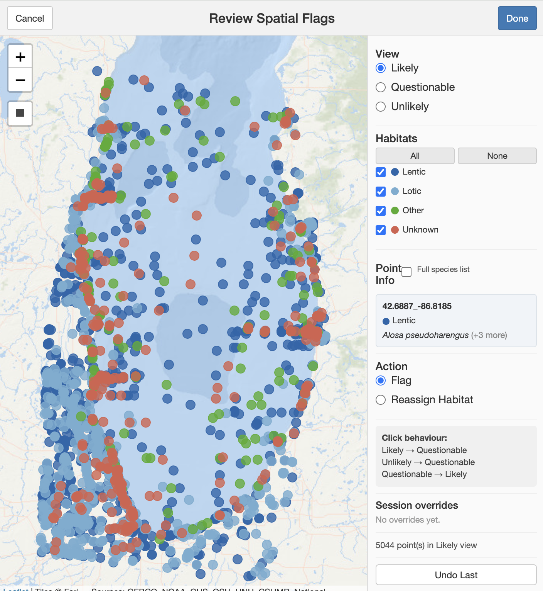

# TaxaHabitat

Habitat assignment and spatial quality control for the
[TaxaID](https://github.com/kdlafferty/TaxaID) ecosystem. Classifies
species into habitat categories using LLM-based biological consensus,
assigns habitats to sampling sites, and flags spatial outliers. It
accepts that species can occur in multiple habitats, but assumes that a
particular sampling location can be defined as a single habitat
category. In other words, it uses the species collected at a location to
guess the habitat at the site where the species was observed. It gets
this right most of the time, and indicates its uncertainty when it can't
decide.

Habitat (e.g., terrestrial, marine, freshwater) is a key predictor of
which species are plausible at a sampling location. In TaxaID, I
recommend a few coarse habitat types rather than a long list of subtle
ones. Incorrect habitat classification leads to false positives when
species from the wrong habitat receive inflated priors. Ideally, a
knowledgeable user assigns each taxon to its habitat. When the species
list is long, LLMs can do a reasonable job of classifying species into
basic habitat categories. As with any LLM output, users should review
the results. `flag_habitat_inconsistencies()` provides an interactive
map that makes errant classifications easier to spot and correct.

The interactive map makes it easier to review and proof occupancy data.
Even well-curated data like GBIF (Global Biodiversity Information
Facility; GBIF Secretariat, Copenhagen, Denmark) have a high frequency
of location errors. By mapping points by habitat type, users can easily
view which observations have incorrect coordinates. The function
`review_spatial_flags(occurrences_flagged)` is designed to help you
review and correct errant points, flagged upstream by
`flag_habitat_inconsistencies()`, before model building begins. For
instance, a point on the map in the middle of the ocean labeled
"Terrestrial" is likely an error in habitat assignment that would
weaken a species distribution
model. This tool makes it possible to delete that point or reassign it
to "Marine". And the selection tool means this can be done in bulk.
TaxaHabitat thus can be a standalone database QAQC for biodiversity
databases and helpful for creating species distribution models from
occupancy data.

## Habitat Schemes

| Scheme | Categories | Use case |
|----|----|----|
| 3-category (default) | Marine / Freshwater / Terrestrial | Most biodiversity surveys (eDNA, camera-trap, acoustic) |
| IUCN Level 1 | 18 IUCN habitat categories | Fine-grained habitat mapping |
| Custom | User-defined | Specialized study designs |

A custom scheme is a plain data frame (`l1_name` required; `l2_name`,
`l2_code`, `realm` optional: see `example_habitat_scheme` for the
exact shape):

``` r
my_scheme <- data.frame(
  l1_name = c("Kelp forest", "Sandy bottom", "Rocky intertidal"),
  realm   = c("marine", "marine", "marine")
)
prompt <- build_habitat_prompt(taxa, habitat_scheme = my_scheme)
```

Don't want to hand-build one? `build_scheme_prompt()` +
`parse_scheme_response()` can draft a scheme from your taxon list via
LLM first, and you edit the result before using it.

## Installation

``` r
# Requires TaxaTools (foundation package)
devtools::install("path/to/TaxaTools")
devtools::install("path/to/TaxaHabitat")
```

## Quick Start

``` r
library(TaxaHabitat)

# 1. Build an LLM prompt for habitat classification
prompt <- build_habitat_prompt(
  c("Fundulus parvipinnis", "Cottus asper", "Anas platyrhynchos")
)

# 2. Submit to an LLM provider
raw_text <- TaxaTools::prompt_api(prompt)

# 3. Parse response into per-species habitat weights
habitat_weights <- parse_hierarchical_habitat_response(raw_text, prompt)
# taxon_name           Marine_weight  Freshwater_weight  Terrestrial_weight
# Fundulus parvipinnis  0.85           0.15               0.0
# Cottus asper          0.0            1.0                0.0
# Anas platyrhynchos    0.05           0.60               0.35

# Steps 1-3 in one call, with a per-taxon on-disk cache -- what every
# production workflow should use. A habitat verdict decides which occurrence
# records count toward a habitat-stratified site prior downstream, so an
# uncached verdict that differs between two runs moves priors by orders of
# magnitude and makes the published taxon list irreproducible. Only taxa not
# already classified under the same scheme are sent to the LLM.
habitat_weights <- build_habitat_lookup(
  c("Fundulus parvipinnis", "Cottus asper", "Anas platyrhynchos"),
  cache_dir = "my_project_habitat_cache"
)
attr(habitat_weights, "cache_summary")   # n_from_cache / n_called

# 4. Assign habitat to sampling sites based on species composition
occurrences_with_habitat <- assign_habitat_biological(
  occurrences, habitat_weights
)

# 5. Flag spatial outliers (marine species at inland sites, etc.)
flagged <- flag_habitat_inconsistencies(occurrences_with_habitat)
```

## Key Functions

Habitat classification:

-   `build_habitat_lookup()`: cached one-call classification (prompt,
    LLM call, parse; a taxon already classified under the same scheme
    is never re-asked)
-   `taxahabitat_clear_cache()`: report or prune this package's cache;
    the shared signature and the cross-package
    `TaxaTools::taxaid_cache_report()` are described in the TaxaID
    README's Caching and resources section
-   `build_habitat_prompt()`: create LLM prompt for species habitat
    weights
-   `parse_hierarchical_habitat_response()`: parse LLM output to
    numeric weights
-   `assign_habitat_biological()`: assign site habitat from species
    composition
-   `consensus_habitat()`: assemblage-level consensus with ecoregion
    extraction
-   `resolve_habitat_by_geography()`: fill in `main_habitat` for
    points the assemblage consensus left unresolved, from the point's
    own location, resolving only where exactly one candidate habitat
    is admissible there

Custom schemes:

-   `build_iucn_scheme()`: generate IUCN Level 1 habitat scheme
-   `example_habitat_scheme()`: example custom scheme for reference
-   `build_scheme_prompt()` / `parse_scheme_response()`: custom scheme
    workflow

Spatial QC:

-   `flag_habitat_inconsistencies()`: flag records inconsistent with
    site habitat
-   `review_spatial_flags()`: interactive Leaflet map for manual
    review
-   `save_spatial_review_decisions()`: save a reviewer's spatial-flag
    decisions from `review_spatial_flags()`'s output to a decisions
    file, keyed by point and taxon
-   `apply_spatial_review_decisions()`: apply saved decisions to
    `flag_habitat_inconsistencies()`'s output before, or instead of,
    opening the review gadget, and report how many flagged points
    still need a reviewer

Institution-proximity flags:

-   `flag_institution_candidates()`: tier records
    `TaxaFetch::filter_gbif_quality()` flagged as near a biodiversity
    institution by how suspicious the match actually is, using the
    matched institution's type and the record's kingdom
-   `review_institution_flags()`: interactive Shiny gadget for
    reviewing institution-proximity flags on a map alongside the
    matched institution's own location

Reporting:

-   `report_habitat()`: summarize habitat assignment for
    `assemble_report()`

## Methods

### Habitat Weight Estimation

Rather than assign each species to a single habitat, TaxaHabitat asks
the LLM to distribute habitat affinity as continuous weights across all
habitat categories (e.g., Marine 0.85, Freshwater 0.15, Terrestrial
0.0), summing to 1.0 per species. This captures habitat generalism (an
estuarine fish contributes partial signal to both Marine and
Freshwater) and avoids the information loss of a categorical
assignment.

Prompts are constructed by `build_habitat_prompt()` (which inputs
habitat types) and sent to an LLM provider via TaxaTools. For large
species lists, taxa are chunked (default 60 per call) into
self-contained prompts. The LLM returns a CSV with numeric weights per
habitat plus an `Other_weight` column and free-text `habitat_best_guess`
for species that do not fit the scheme.
`parse_hierarchical_habitat_response()` validates that row sums are
within tolerance (warns if deviation \> 0.05 from 1.0) and folds
unrecognized habitat columns into `Other_weight`.

### Site Habitat Assignment

`assign_habitat_biological()` assigns a habitat to each sampling
[location]{.underline} based on the species observed there. For each
point, the function joins occurrence records to species-level habitat
weights, sums weight vectors across species, normalizes to proportions,
and assigns the habitat with the highest proportion if it exceeds a
threshold (default 0.3). The threshold is lower than a simple majority
(0.5) because generalist species spread weight across multiple habitats,
diluting any single category.

By default, each species counts equally regardless of how many times it
was recorded at a point (`weight_by_abundance = FALSE`). This assumes
occurrence record counts reflect sampling effort more than habitat.

### Assemblage-Level Consensus

`consensus_habitat()` infers site habitat from a species list alone
(without occurrence coordinates), using the same weighted-voting logic.
When an `ecoregion_best_guess` column is present (from LLM output with
`geographic_context`), the modal ecoregion across species is returned
alongside the habitat consensus.

### Spatial Quality Control

TaxaHabitat can do some basic ground truthing of its habitat assignments
using habitat polygons to overlay the search area.
`flag_habitat_inconsistencies()` checks whether each occurrence record
is spatially consistent with its assigned habitat using vector polygons
(Natural Earth land/ocean boundaries; a public-domain map dataset
maintained by volunteer cartographers with support from the North
American Cartographic Information Society, naturalearthdata.com) and
raster bathymetry (GEBCO, the General Bathymetric Chart of the Oceans;
maintained by the GEBCO Compilation Group and hosted by the British
Oceanographic Data Centre, Liverpool, United Kingdom). Each record is
classified into a physical zone:

| Zone           | Definition                                |
|----------------|-------------------------------------------|
| inland         | Inside land polygon, \> 1 km from coast   |
| coastal        | Within 1 km of coastline (either side)    |
| marine_shallow | Ocean, 0--200 m depth (continental shelf) |
| marine_deep    | Ocean, 200--4000 m depth (bathyal)        |
| marine_abyssal | Ocean, \> 4000 m depth                    |

Records are then cross-referenced against the habitat's expected realm
(marine, freshwater, terrestrial) and flagged at three levels: "likely"
(consistent), "questionable" (borderline, e.g., marine species very near
shore), or "unlikely" (clear mismatch, e.g., terrestrial species in open
ocean). The 1 km coastal buffer accounts for GPS uncertainty and tidal
gradients. `review_spatial_flags()` provides an interactive Leaflet map
for manual inspection and correction.

The Natural Earth and GEBCO reference layers themselves are fixed:
`flag_habitat_inconsistencies()` does not currently accept a
user-supplied coastline, bathymetry, or other custom spatial reference
layer. Only the numeric thresholds above (`coast_buffer_m`,
`depth_neritic_m`, `depth_oceanic_m`, bathymetry `resolution`) are
tunable.



`review_spatial_flags()` (real Great Lakes data shown above) is where
`flag_habitat_inconsistencies()`'s output actually gets reviewed: points
are colored by habitat category, clicking one shows its species list,
and the sidebar's Flag / Reassign Habitat controls let you correct a
misclassified point without leaving the map.

### Reviewing at scale

Real selection boundaries follow coastlines, lake shores and basins, so
the draw toolbar offers a polygon as well as a rectangle. Both
select every visible point of the current view inside the shape; in Flag
mode the shape applies immediately, in Reassign Habitat mode it selects
and Confirm applies. Each bulk action is one entry in the undo
history, so Undo Last reverses a whole selection in a single click.

At or below `bulk_confirm_threshold` (default 10,000) an action applies
straight away; above it a dialog reports the exact count and requires an
explicit Apply; above `bulk_max` (default 100,000) it is refused to help
avoid crashing.

Markers render to a canvas rather than one SVG node each, which is what
makes a large flagged set openable at all.

Uncertain points are displayed (and counted) according to their
competing habitats, e.g., `"Estuarine | Freshwater"`, and therefore
selectable as a group, which makes habitat assignment to one of those
habitats more efficient.

## LLM Integration

TaxaHabitat uses the `llm_fn` pattern from TaxaTools. The default
provider is `call_anthropic_api()` (Anthropic Claude; Anthropic PBC, San
Francisco, California), but any compatible provider works:

``` r
# Use Gemini instead
raw_text <- TaxaTools::prompt_api(prompt, llm_fn = TaxaTools::call_gemini_api)

# Same, through the cached wrapper (pass a new cache_tag, or clear the
# cache, when you change model and want fresh verdicts)
habitat_weights <- build_habitat_lookup(taxa, llm_fn = TaxaTools::call_gemini_api,
                                        cache_dir = "my_project_habitat_cache",
                                        cache_tag = "gemini")
```

`call_gemini_api()` calls Google Gemini (Google LLC, Mountain View,
California); other supported providers include OpenAI (OpenAI OpCo, LLC,
San Francisco, California) and local Ollama (Ollama, Palo Alto,
California), see TaxaTools.

## API Keys

Requires an Application Programming Interface (API) key for at least one
LLM provider (Anthropic by default). See the TaxaTools [API Setup
vignette](../TaxaTools/vignettes/api-setup.Rmd) for configuration.

## Vignettes

-   [Habitat Assignment](vignettes/habitat-assignment.Rmd): full
    workflow guide

## Part of TaxaID

TaxaHabitat receives occurrence data from TaxaFetch and produces
habitat-annotated records for TaxaExpect (prior estimation).

Ecosystem: TaxaTools -\> TaxaFetch -\> TaxaHabitat -\>
TaxaExpect -\> TaxaAssign

See the [TaxaID README](https://github.com/kdlafferty/TaxaID) for
ecosystem overview and installation instructions.

## Citation

Lafferty, K.D., 2026, TaxaID: A modular R ecosystem for Bayesian
taxonomic assignment: U.S. Geological Survey software release,
<https://doi.org/10.5066/xxxxxx>.

## Software Requirements

-   R (\>= 4.1.0; R Core Team 2025)
-   TaxaTools (for LLM provider functions)
-   An LLM API key is required for habitat assignment via
    `build_habitat_lookup()`

All dependencies are declared in the DESCRIPTION file and installed
automatically.

Developed with [Claude Code](https://claude.ai/code) (Anthropic PBC, San
Francisco, California).

## References

R Core Team (2025). R: A Language and Environment for Statistical
Computing. V.4.5.2. R Foundation for Statistical Computing, Vienna,
Austria. <https://www.r-project.org>
