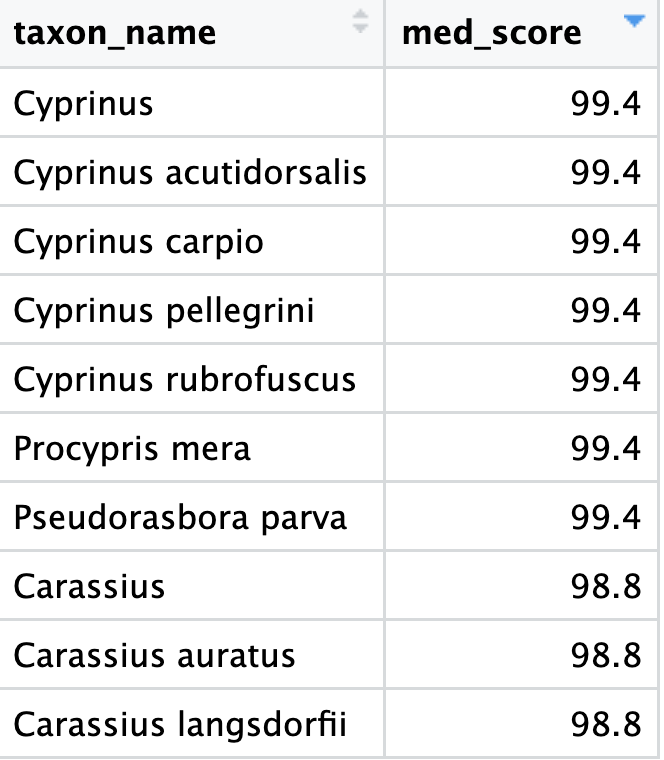
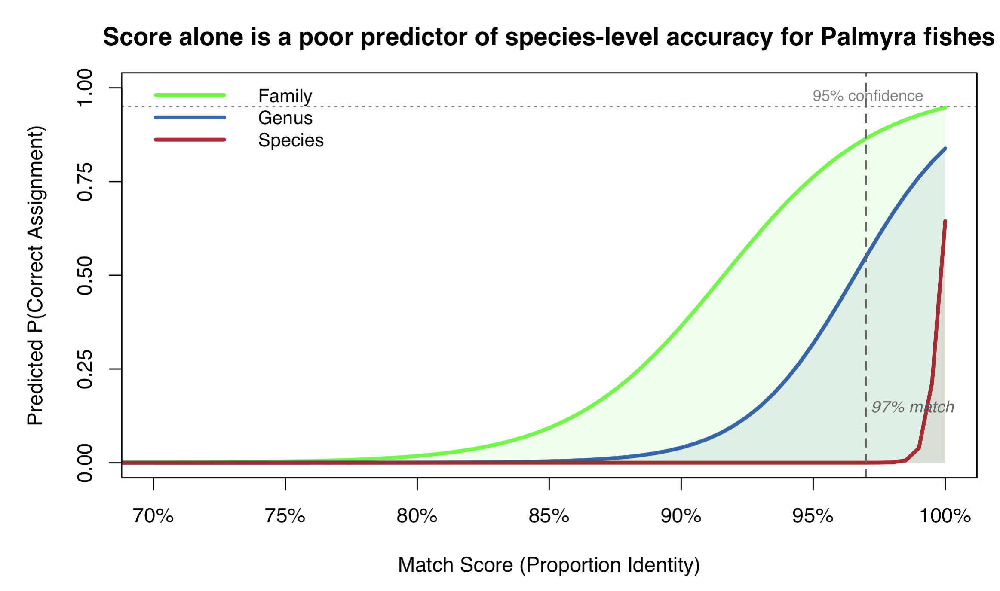
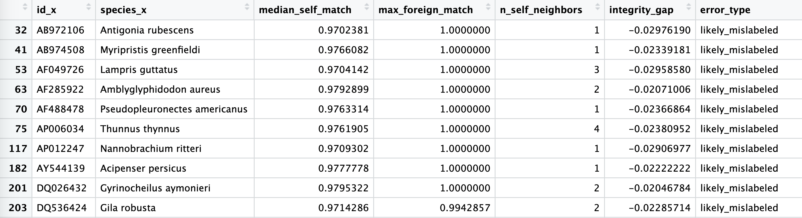
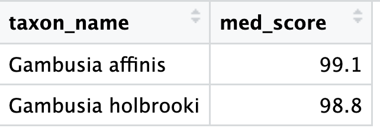
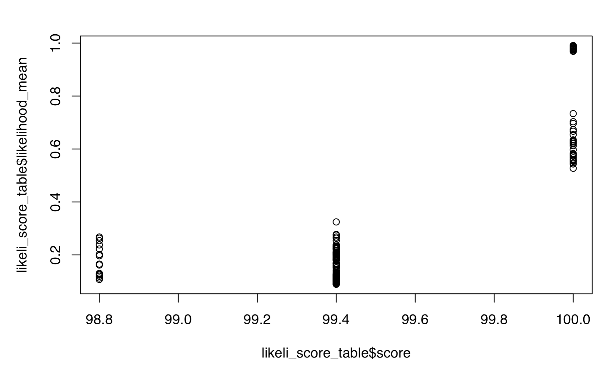
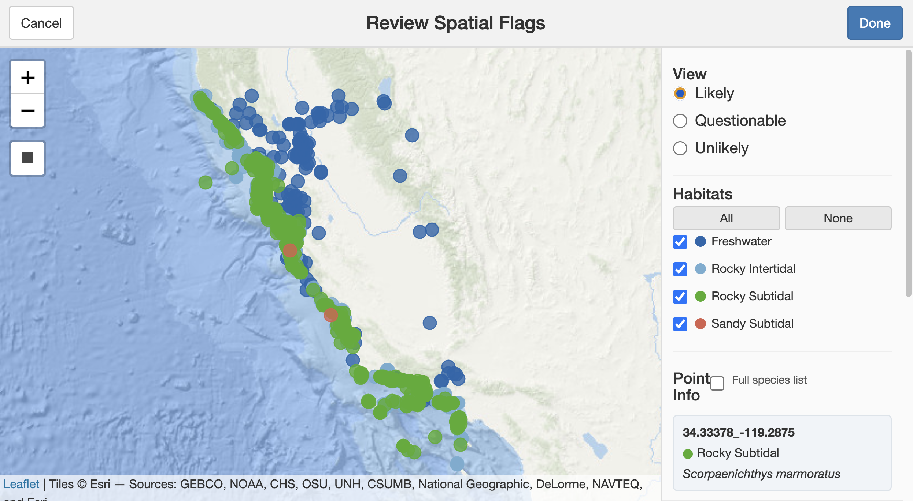
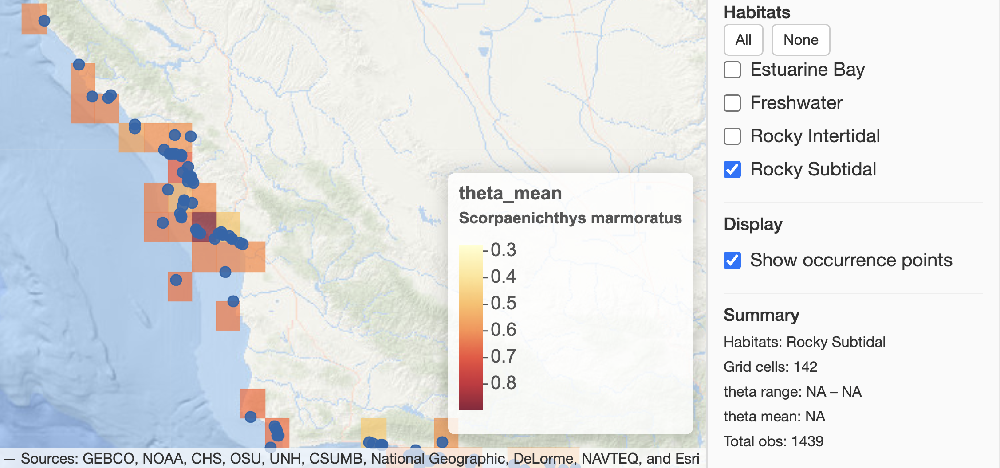
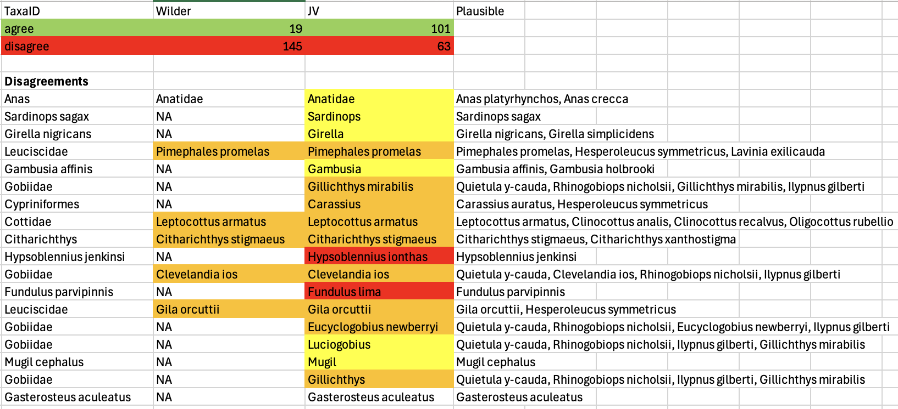

## How Most Pipelines Assign Taxa

The conventional approach:

1. Obtain a DNA sequence (filter by length) e.g., CACCGCG…
2. BLAST it against a reference database (sometimes location-specific)
3. Select references with the **top matching score(s)**
4. Assign a consensus taxon
    - (optional) uprank by **% identity threshold** (e.g., >98% = species rank)
    - If >1 species, uprank to Lowest Common Ancestor

 {width=20%}     
 
## Problem: High false negative and false positive assignments

False Negatives: Most taxa don't have references.  And many markers don't assign to species. 

. . .

False Positives: Shea and Boehm (2024) found that standard algorithms matched 117 out of 415 metazoan sequences to taxa not even present in the study area. 

## Problem: Scores are not probabilities

- Raw match scores are not probabilities (100% match is not 100% certain)
- Match-rank thresholds vary among taxa (>98% match is not always a species)
   
  {width=80%}     


## Problem: Assignments have unknown uncertainty

-  Assignment methods vary in conservativism
-  No confidence quantification (client is mistakenly confident)
- "Best" match and upranking hide alternative matches (though JV provides ESV file!)

## What is TaxaID?

An R package ecosystem that uses **Bayes' Theorem** to assign taxa to eDNA samples

**What TaxaID produces:**

- plausible consensus taxonomy, including unreferenced taxa, with confidence assessment among alternatives.

**What sets TaxaID apart:**

- Uncertainty quantification

- Reference repair

- Consideration of unreferenced species

- Ecological priors from real distribution data

- Not just "best guess" — full posterior distribution

- Plausible alternative archive

- Report writing

- LLM operational


**7 packages — >90 exported functions — 3 assignment paths — 1 framework**


## The TaxaID Ecosystem — Seven Packages
| Package | Role |
|-|----|
| **TaxaTools** | Name cleaning, backbone translation, LLM providers |
| **TaxaMatch** | ESV file input and standardization |
| **TaxaLikely** | Reference auditing, score → likelihood conversion |
|| |
| **TaxaFetch** | Distribution data: GBIF, DataONE, PDF extraction, literature search |
| **TaxaHabitat** | LLM-based habitat classification, spatial QAQC |
| **TaxaExpect** | Spatial models from occurrence data → Bayesian priors |
|| |
| **TaxaAssign** | Bayes' theorem → posteriors → LCA consensus → reports |

## TaxaLikely: Audit the reference library

A reference that matches other species better than it matches its own species is a likely error. We can remove these from the reference library before going further.

. . .

 {width=80%}     


## Missing References

Many species lack reference sequences entirely

. . .

:::: {.columns}
::: {.column width="50%"}
**The problem:**

- GenBank coverage is uneven
- Newly described species
- Rare or poorly studied taxa
- Regional endemics

A species with no reference **can never be the top BLAST hit**
— but it might be the true source
:::

::: {.column width="50%"}
**TaxaLikely can audit references:**

```r
coverage <- audit_barcode_coverage(
  reference_species,
  barcode_term = "12S",
  max_date = "2024-01-01"
)

coverage$census
#>   genus        in_ref  unreferenced
#>   Gila         3       2
#>   Catostomus   2       1
```
:::
::::

. . .

> If we ignore unreferenced species, we **guarantee** misassignment when
> they are present in our samples. We can make a list of missing references to see
> if any are expected at our sampling site.

## TaxaLikely: from Scores to Likelihoods

By modeling score distributions from a **reference database**, we can convert
any match score into a **likelihood**: *"How likely is this score if the sample
truly belongs to species X?"*

. . .

**TaxaLikely trains a statistical model on your reference:**

 {width=20%} 
 score and gap are predictive of likelihood

. . . 

```r
# 1. Fetch reference sequences from NCBI (broader than match object)
reference_df <- fetch_reference_sequences(
  taxa = c("Fundulus", "Gambusia", "Eucyclogobius"),
  barcode_term = "12S"
)

# 2. Build pairwise distance matrix
ref_matrix <- build_reference_matrix(reference_df)

# 3. Screen for mislabeled references
errors <- flag_reference_errors(ref_matrix)

# 4. Clean mislabeled references
clean_ref_matrix <- ref_matrix - errors

# 5. Train likelihood model (score → probability)
model <- train_likelihood_model(clean_ref_matrix)

# 6. Apply to query data — returns likelihoods per hypothesis
result <- evaluate_likelihoods(match_df, model)
```

The reference sequences come from a **broad NCBI search by taxon + marker** —
not just the accessions in the match object, which are a biased subset

## Contrast likelihoods for referenced species

Example predictions:

| Candidate | Score | Gap | Likelihood |
|---|---|---|---|
| Species A (correct) | High | Large | **High** |
| Species B (wrong) | Lower | Small | **Low** |
| Species C (wrong) | Lower | Small | **Low** |

Each candidate is evaluated against its **own** expected distribution.
Species B expects near-perfect scores from its true matches — a mediocre
score falls in the tail of its distribution.


## What is the likelihood of unreferenced species?

For each sequence, we also simulate the case that all hypotheses are incorrect
because the true species is unreferenced at the species or the genus rank.

I.e., if there are no high matches in the reference database, there is a
higher chance that the true species is unreferenced.

. . .

> This gives the model **permission to say "none of the above"** —
> preventing false-confident assignments when the true species is missing. 
> Later we will use these hypothetical likelihoods for unreferenced, but plausible species.


## Estimated Likelihoods

{width=80%}

Likelihoods correlate with scores, but differ in important ways:

1. Scores are transformed to a proper probability scale
2. The gap between best and second-best match informs likelihood
3. Each species has its own intercept via a hierarchical (random effects) model
4. Modeled likelihoods carry a standard deviation for uncertainty estimation


## Enter Bayes' Theorem

$$P(\text{species} \mid \text{score}) = \frac{P(\text{score} \mid \text{species}) \times P(\text{species})}{P(\text{score})}$$

or


$$\text{Posterior} \propto \text{Likelihood} \times \text{Prior}$$

. . .

In plain terms:

| Term | Meaning | Source |
|---|---|---|
| **Posterior** | Probability a sample is sp. X | *What we want* |
| **Likelihood** | How expected is this score if it *is* sp. X | TaxaLikely |
| **Prior** | Probability a sample at this location/habitat is sp. X | TaxaExpect |
| **Evidence** | Normalizing constant | Computed automatically |

. . .

**The prior is the key innovation** — it encodes ecological knowledge:
*"What species would we expect to find here?"*


## Building Priors: Would We Expect Species Here?

Starting from the higher-ranks in a sample (families, genera), we
tabulate observed locations of **plausible species** near the sampling location

. . .

**Step 1 — Gather occurrence data (species observations at spatial locations)**

```r
# TaxaFetch: multiple data sources
gbif_data    <- fetch_gbif_occurrences(taxon_keys)
dataone_data <- fetch_dataone_occurrences(dataset_id)
pdf_data     <- extract_occurrences_from_pdf(pdf_path)

# Combine with standardized taxonomy
all_occurrences <- stack_occurrences(gbif_data, dataone_data, pdf_data)
```

Different sources use different **taxonomic backbones** (GBIF, NCBI, ITIS) —
TaxaTools harmonizes them via `change_backbone()`

TaxaFetch provides species occurrence data from around our sampling site. We can use these data to model species plausibility at our sampling site.

## Because locations can be coarse, we also need habitat information to predict distributions.

Occurrence records tell us *where* a species has been found, but not *what
habitat* it prefers.
. . .

**A user could do their own habitat research, or**

. . .

**TaxaHabitat uses LLMs to classify species habitat affinities:**

```r
prompt <- build_habitat_prompt(
  species_list,
  geographic_context = "Southern California coast"
)

response <- prompt_api(prompt, llm_fn = call_anthropic_api)
habitat_weights <- parse_hierarchical_habitat_response(response)

# Use species habitat affinities to define habitat where occurrences are reported
occurrences_with_habitat <- assign_habitat_biological(
  occurrences, habitat_weights
)
```

. . .

LLMs synthesize published ecological knowledge at scale — replacing
manual literature review with a single API call

        
## LLMS and occurrence records are imperfect, so users can manually inspect and correct habitat assignments and location records.
   
  {width=80%}                                


## From Occurrences to Spatial Priors

**TaxaExpect** builds hierarchical species distribution models using an optimized spatial grid.

. . .

```r
# Spatial grid + model fitting
grid_result <- optimize_grid_size(occurrences_with_habitat)
model_data  <- prepare_model_dataframe(gridded_data)
model_fit   <- train_biodiversity_model(model_data, formula)

# Generate priors: P(species X | location, habitat)
priors <- generate_full_priors(model_fit, prediction_grid)
```

. . .

The model accounts for:

- **Spatial structure** — Moran eigenvectors for autocorrelation
- **Habitat** — species-specific habitat preferences
- **Effort** — occurrence records are assumed proportional to sampling effort

Output: **Beta(α, β) prior** per species × grid cell × habitat

## TaxaExpect: Predicted Priors

Users can evaluate model predictions around their sampling site.

{width=80%}

Then use the model to predict the theta prior at the sampling location.
  
## Priors for Undetected Species

Not every species at a location has been recorded there. TaxaExpect also estimates priors for unrecorded species.

. . .

```r
# Estimate priors for species expected but never observed at a site
dark_diversity <- generate_undetected_diversity(
  model_fit, prediction_grid
)
```

. . .

- **Singleton extrapolation** — species seen once nearby get small priors
- **Global floor** — a minimum prior for regionally plausible species
- These "dark diversity" priors prevent false negatives

> Without undetected species priors, Bayes' theorem would assign zero
> probability to species not yet recorded at the exact sampling location


## Computing Posteriors

Now we combine likelihoods and priors:

$$\text{Posterior} \propto \text{Prior} \times \text{Likelihood}$$

```r
# Join likelihoods to priors via sample metadata
combined <- join_priors(
  likelihoods, taxaexpect_priors,
  sample_meta, dark_diversity_priors
)

# Compute posteriors with uncertainty
posteriors <- compute_posterior(combined, n_sims = 1000)
```

. . .

```r
posteriors
#>   sample_id  taxon_name          posterior_mean  posterior_sd  hypothesis_type
#>   ESV_001    Gila orcuttii       0.72            0.08          specific_candidate
#>   ESV_001    Gila elegans        0.03            0.01          unreferenced_species
#>   ESV_001    Ptychocheilus lucius 0.18            0.06          specific_candidate
#>   ESV_001    Catostomus [genus]  0.07            0.04          unreferenced_genus
```

Monte Carlo simulations propagate uncertainty from both priors and likelihoods
through to the posterior — giving honest confidence intervals


## Unreferenced Species Get Posteriors Too

Species with priors, but missing from the reference database, get their likelihoods from TaxaLikely unreferenced species and genus estimates. This way, we can assign unreferenced species to a sample.


```r
# Expand generic "unreferenced" rows into named species
expanded <- expand_unreferenced_hypotheses(
  likelihoods, unreferenced_species, taxaexpect_priors
)
```
> This is one of TaxaID's most distinctive features — no other eDNA pipeline
> generates posterior probabilities for species absent from the reference

. . .
Alternatively, an LLM approach can generate priors more quickly:

- LLM suggests **plausible unreferenced species** per genus
- NCBI confirms they lack barcode sequences
- We approximate their likelihood from their relatives


## Consensus Taxonomy

Multiple hypotheses → one assignment per sample via **Lowest Common Ancestor (LCA)**

. . .

```r
consensus <- posterior_consensus(
  posteriors,
  cumulative_threshold = 0.95,  # include taxa until 95% posterior mass
  min_posterior = 0.01          # ignore negligible hypotheses
)
```

. . .

:::: {.columns}
::: {.column width="50%"}
**When one species dominates:**

→ Species-level assignment with high confidence

**When two congeners compete:**

→ Genus-level assignment (upranking via LCA)
:::

::: {.column width="50%"}
**Critical: retain alternatives**

The consensus taxon is a summary — but the
full posterior distribution across all
hypotheses is always available for downstream
analysis
:::
::::

## Bayesian updating!

If the consensus shows that some ESVs have high confidence that a particular species occurs, TaxaAssign let's us update our priors with these insights.
. . .

```r
posteriors #the old information
consensus #has new information!


updated_posteriors <- update_prior_from_consensus(
  posteriors, consensus,
  presence_multiplier = 5,
  n_sims              = 1000
)

updated_consensus <- posterior_consensus(
  updated_posteriors
)

```


## LLM methods and results generated

```r
report_posterior <- generate_report(
result    = result_updated,
consensus = consensus_final,
unreferenced_result = unreferenced_species,
data_type = "eDNA", marker = "12S MiFish",
study_description = "eDNA survey of a southern California estuary",
llm_fn = TaxaTools::call_anthropic_api
)
```

"Taxonomic assignments were made from 12S MiFish metabarcoding sequence data. Rather than the conventional method of basing taxonomic assignments on likelihood scores alone, assignments were estimated using a Bayesian framework in which both match likelihoods and occurrence priors were approximated by a large language model (LLM), rather than derived from statistical training on the reference database and species occurrence records, respectively.

Likelihoods were derived..."


## Bayesian vs. Conventional Consensus

```r
# Side-by-side comparison
bayesian  <- posterior_consensus(posteriors)
conventional <- score_consensus(match_df)
```

. . .

| Scenario | Conventional (score threshold) | Bayesian (TaxaID) |
|---|---|---|
| High score, species not expected here | Assigns to species | Downweights — prior is low |
| Moderate score, species very common here | May reject (below threshold) | Assigns — strong prior |
| Close scores for two congeners | Picks top hit | Genus-level (honest uncertainty) |
| Species absent from reference | Invisible | Detected via unreferenced priors |

. . .

> Bayes' theorem naturally handles cases where conventional thresholds
> either over-commit or miss the target entirely


## The LLM Shortcut

The full Bayesian pipeline requires API queries and computation.
**TaxaAssign offers an LLM-based alternative:**

. . .

```r
# One function replaces TaxaFetch + TaxaHabitat + TaxaExpect
result <- assign_taxa_llm(
  match_df,
  ctx = build_context(species_list),  # auto-populated via LLM
  llm_fn = call_anthropic_api
)
```

. . .

**What the LLM does internally:**

- Estimates whether each species is **expected, plausible, or unlikely** at the location
- Assesses **habitat fit** (expected / occasional / unlikely)
- Rates **information quality** (high / moderate / low) per taxon
- These become Beta-distributed priors that feed into `compute_posterior()`

. . .

::: {.callout-tip}
The LLM workflow is fast, requires no external data downloads, and
often agrees with the full Bayesian approach — but is less reproducible.
Best for exploration or when time is short.
:::


## The TaxaID Ecosystem — Three Paths

**Conventional** (fastest, but least accurate)

```
TaxaMatch ──────────────────────────────────────────→ TaxaAssign
  (input)              (thresholds)                   (scores → consensus → report)

```

. . .

**Full Bayesian** (slowest, but most accurate)

```
TaxaMatch ─→ TaxaLikely ─→ TaxaFetch ─→ TaxaHabitat ─→ TaxaExpect ─→ TaxaAssign
  (input)    (likelihood)   (occurrence)   (habitat)      (prior)  (posterior → consensus → report)

```

. . .

**LLM API** (fast and accurate)

```
TaxaMatch ──────────────────────────────────────────→ TaxaAssign
  (input)                                             (posteriors → consensus → report)
```


## Comparing LLM with conventional approaches

{width=80%}

- **Yellow** — False negative
- **Orange** — Over-confident
- **Red** — False positive

## For Sequencers

:::: {.columns}
::: {.column width="50%"}
**Use in-house:**

- Conventional and LLM assignment
- Report generation
- Identify reference gaps
- Filter reference errors
:::

::: {.column width="50%"}
**For users:**

- Full Bayesian workflow option for clients who want to publish
:::
::::

## Package Details: TaxaTools (12 functions) {.smaller}

**Foundation package** — name cleaning, backbone translation, LLM provider wrappers

| Function | What it does |
|---|---|
| `clean_taxon_names()` | Strip authors, brackets, normalize whitespace |
| `verify_taxon_names()` | Check names against Global Names Verifier API |
| `create_taxon_names()` | Derive `taxon_name` + rank from taxonomy columns |
| `change_backbone()` | Translate between GBIF, NCBI, ITIS, WoRMS, CoL |
| `rename_cols()` | Map arbitrary column names to DarwinCore standard |
| `prompt_api()` | Submit multi-chunk LLM prompts with retries |
| `call_anthropic_api()` | Anthropic Claude provider |
| `call_openai_api()` | OpenAI provider |
| `call_gemini_api()` | Google Gemini provider |
| `call_ollama_api()` | Local Ollama provider |
| `prompt_manual()` | File-based handoff for manual LLM submission |
| `read_llm_response()` | Read saved manual LLM responses |

## Package Details: TaxaMatch (2 functions) {.smaller}

**Thin standardization layer — accepts any match format**

| Function | What it does |
|---|---|
| `standardize_match_data()` | Convert raw matches to canonical format |
| `filter_redundant_hypotheses()` | Drop higher-rank rows superseded by finer-rank |

Accepts any input format:

- BLAST output
- DADA2 + INSECT scores
- Image similarity scores
- Acoustic match scores

## Package Details: TaxaLikely (11 functions) {.smaller}

**Reference Audit, score → likelihood conversion**

| Stage | Function | What it does |
|---|---|---|
| **Acquire** | `fetch_reference_sequences()` | Search NCBI by taxon + marker → reference sequences |
| | `read_reference_fasta()` | Load local FASTA + taxonomy table |
| **QC** | `build_reference_matrix()` | Pairwise distances from reference sequences |
| | `flag_reference_errors()` | Detect mislabeled references |
| **Train** | `train_likelihood_model()` | Fit H1/H2/H3 score distributions |
| **Infer** | `evaluate_likelihoods()` | Per-hypothesis likelihoods for queries |
| | `filter_top_hypotheses()` | Keep finest-rank candidates |
| **Audit** | `audit_barcode_coverage()` | Which species lack barcode sequences? |
| | `audit_reference_coverage()` | Taxonomic completeness check |
| | `apply_coverage_constraints()` | Suppress impossible hypotheses |
| **Diagnose** | `interpret_model()` | Summarize model parameters |


## Package Details: TaxaFetch (24 functions) {.smaller}

**Data acquisition** — GBIF, DataONE, literature PDFs

:::: {.columns}
::: {.column width="50%"}
**GBIF pipeline:**

- `get_keys_from_context()` — resolve names to GBIF keys
- `make_bbox_wkt()` — bounding box for spatial queries
- `fetch_gbif_occurrences()` — download records
- `filter_gbif_quality()` — remove low-quality rows

**DataONE pipeline:**

- `search_dataone()` — find datasets
- `harvest_dataone_catalog()` — full EDI catalog
- `screen_eml_columns()` — check data structure
- `fetch_dataone_occurrences()` — download records
:::

::: {.column width="50%"}
**Literature / PDF pipeline:**

- `search_literature()` — query OpenAlex
- `download_literature_pdfs()` — fetch PDFs
- `screen_pdf_structure()` — classify PDF content
- `extract_pdf_text()` — parse sections
- `build_pdf_extract_prompt()` — LLM extraction prompt
- `parse_pdf_extract_response()` — parse to DarwinCore

**Combination:**

- `stack_occurrences()` — row-bind all sources
- `combine_occurrence_sources()` — standardize + merge
:::
::::


## Package Details: TaxaHabitat (10 functions) {.smaller}

**LLM-based habitat classification + spatial QAQC**

| Function | What it does |
|---|---|
| `build_habitat_prompt()` | Species → habitat LLM prompt |
| `parse_hierarchical_habitat_response()` | Parse LLM response → weight table |
| `assign_habitat_biological()` | Assign site habitat from species composition |
| `consensus_habitat()` | Assemblage-level consensus habitat |
| `build_iucn_scheme()` | IUCN habitat classification categories |
| `build_scheme_prompt()` | Custom habitat scheme prompt |
| `parse_scheme_response()` | Parse custom scheme LLM response |
| `flag_habitat_inconsistencies()` | Land/ocean/depth spatial checks |
| `review_spatial_flags()` | Shiny gadget for reviewing flags |
| `example_habitat_scheme()` | Example habitat scheme dataframe |


## Package Details: TaxaExpect (9 functions) {.smaller}

**Occurrence data → spatial priors**

| Step | Function | What it does |
|---|---|---|
| 1 | `optimize_grid_size()` | Best spatial resolution for the data |
| 2 | `create_sites_from_grid()` | Snap coordinates to grid |
| 3 | `prepare_model_dataframe()` | Species × site matrix, zero-filled |
| 4 | `compute_moran_basis()` | Spatial eigenvectors for autocorrelation |
| 5 | `screen_spatial_formula()` | Select parsimonious model by AIC |
| 6 | `train_biodiversity_model()` | Hierarchical GLMM: P(species \| location, habitat) |
| 7 | `generate_full_priors()` | Beta(α, β) per species × grid cell |
| 8 | `generate_undetected_diversity()` | Priors for species not yet observed |
| — | `plot_theta_map_interactive()` | Shiny gadget: visualize predicted priors |


## Package Details: TaxaAssign (10 functions) {.smaller}

**Convergence point — posteriors + consensus + reporting**

| Function | What it does |
|---|---|
| `assign_taxa_llm()` | LLM shortcut: priors + likelihoods in one call |
| `build_context()` | Auto-populate site context via LLM |
| `suggest_unreferenced_species()` | LLM + NCBI: find species missing from reference |
| `expand_unreferenced_hypotheses()` | Insert named unreferenced species into likelihood table |
| `join_priors()` | Merge likelihoods with TaxaExpect priors + dark diversity |
| `compute_posterior()` | Bayes' theorem with Monte Carlo uncertainty |
| `update_prior_from_consensus()` | Empirical Bayes: refine priors from confident calls |
| `posterior_consensus()` | LCA consensus from posterior probabilities |
| `score_consensus()` | Conventional score-based consensus (for comparison) |
| `generate_report()` | Publication-ready Methods + Results text |

